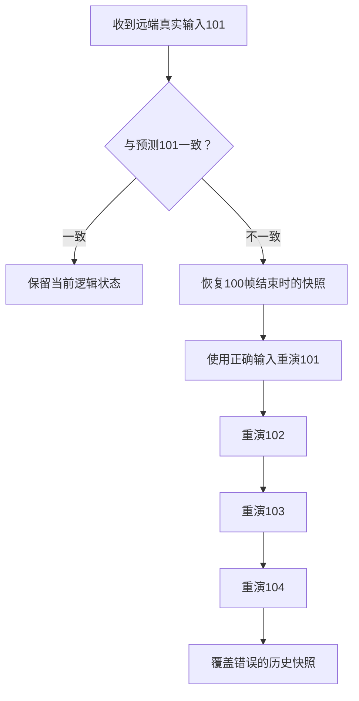
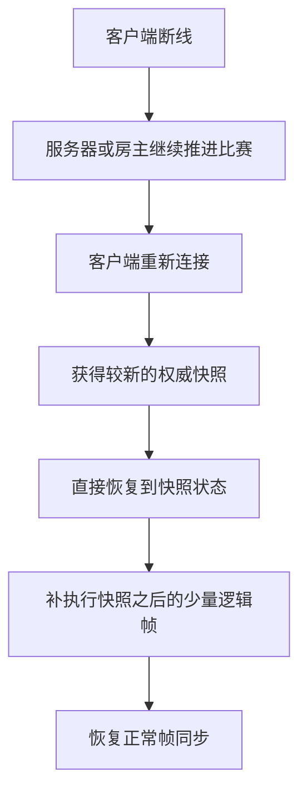
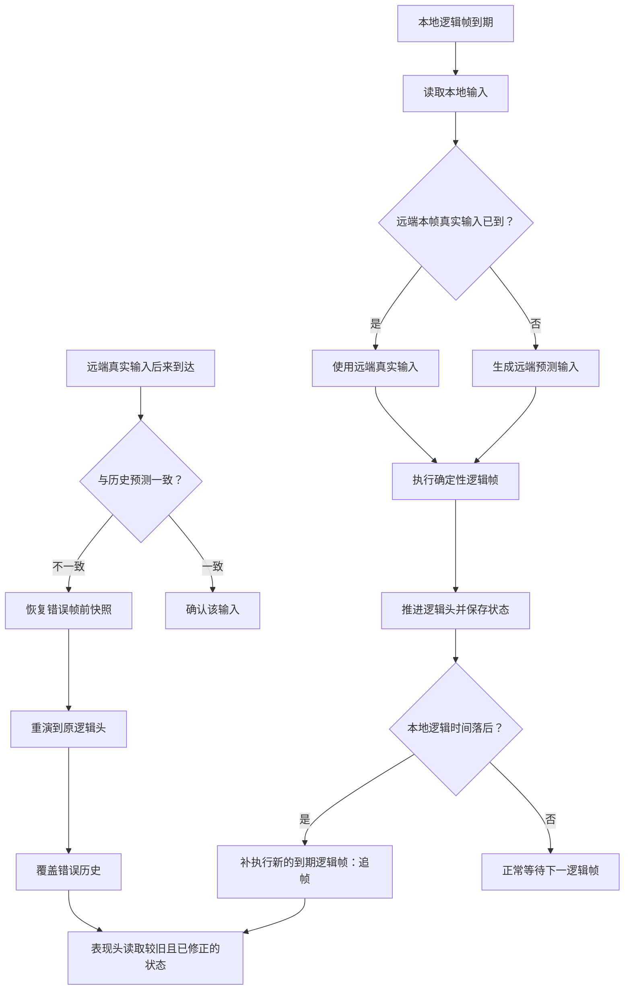

# 帧同步：预测、回滚、表现延迟与追帧——对话总结

> 日期：2026-08-11  
> 项目：帧同步 Route C  
> 用途：汇总本轮关于远端输入、预测、回滚、表现延迟、追帧及断线重连的讨论，作为后续设计与验证依据。

## 1. 本轮讨论的核心结论

当前讨论中最容易混淆的是以下四套机制。它们互相关联，但解决的问题不同：

| 机制 | 解决的问题 | 是否推进逻辑头 | 是否重写历史 | 主要代价 |
|---|---|---:|---:|---|
| 远端输入缓冲 | 保存按帧编号到达的远端真实输入 | 否 | 否 | 内存、管理复杂度 |
| 输入预测 | 远端真实输入尚未到达时，让逻辑继续运行 | 是 | 否 | 可能预测错误 |
| 回滚重演 | 真实输入与预测不一致时，修正已经算错的历史 | 否，最终回到原逻辑头 | 是 | CPU峰值、画面修正风险 |
| 追帧 | 本地逻辑时钟因为卡顿而落后真实时间时，补执行到期的新逻辑帧 | 是 | 否 | CPU峰值、画面跳变、预测区可能扩大 |
| 表现延迟/插值 | 隐藏预测修正和回滚造成的视觉回扯 | 否 | 否 | 玩家看到的远端画面更晚 |

一句话区分：

> 预测负责“未来暂时没有答案怎么办”；回滚负责“刚才猜错了怎么办”；追帧负责“本机来不及按时计算怎么办”；表现延迟负责“怎样让修正过程不难看”。

---

## 2. 三个“头”的正确含义

讨论中使用了“三个头”的说法，准确含义如下。

### 2.1 逻辑头（Logic Head）

本地已经完成模拟的最新逻辑帧。这个世界可能同时包含：

- 本地真实输入；
- 已到达的远端真实输入；
- 尚未到达部分的远端预测输入。

所以逻辑头是“当前最新模拟结果”，不等于“所有输入都已经确认的真实世界”。

### 2.2 远端真值头（Remote Truth Head）

已经连续获得远端真实输入的最新帧。

例如远端真实输入只连续到100帧，而本地逻辑已经算到103帧：

```text
远端真值头：100
逻辑头：    103
预测区间：  101～103
```

### 2.3 表现头（Presentation Head）

表现层当前正在读取和显示的历史状态帧。它可以故意落后逻辑头一帧或多帧，以便回滚修正先完成，再让画面读取修正后的状态。

### 2.4 预测不是第四个头

“远端预测输入”不是一个独立推进的时间头，而是逻辑头与远端真值头之间缺失输入的临时填充值。


---

## 3. 远端输入缓冲容量不等于表现延迟

### 3.1 扩大远端输入缓冲容量

扩大容量的含义是：允许本地保存更多带帧号的远端输入记录，例如从保存120帧扩大到240帧。

它主要用于：

- 防止输入记录因为容量太小而过早被覆盖；
- 支持更长的回滚窗口；
- 容纳网络抖动、乱序或短时间批量到包；
- 为重放、诊断和快照恢复保留更多历史。

它不能直接：

- 让远端输入更早到达；
- 降低预测失败概率；
- 减少逻辑回滚次数；
- 自动隐藏回滚画面；
- 消除某一帧收到大量数据后的处理压力。

因此，“扩大缓冲容量主要为了防止一瞬间收到太多包导致一帧负担加重”这一说法不准确。容量解决的是“存不存得下”，单帧负担解决的是“这一帧处理多少、如何分批处理”。

### 3.2 增加一帧表现延迟

表现延迟是让渲染层读取比逻辑头更旧的状态。例如：

```text
逻辑头：103
表现延迟：1帧
表现层读取：102附近的状态
```

当103帧预测错误并被回滚修正时，表现层还没有显示103，因此可能直接读取修正后的103，减少“先显示错误位置、再拉回正确位置”的回扯。

表现延迟的核心效果是：

- 逻辑仍然照常预测、回滚和同步；
- 只让玩家看到的画面晚一帧或多帧；
- 不会降低逻辑层实际发生回滚的次数；
- 可以降低玩家看见回滚修正的概率。

---

## 4. 本地输入、远端真实输入与预测输入

每个逻辑帧只有一次正式模拟，只是输入来源可能不同：

```text
帧F的输入 = 本地帧F输入 + 远端帧F真实输入（如果已到达）
                          或远端帧F预测输入（如果未到达）
```

不存在“游戏正常运行帧”和“在它之后额外运行一个预测帧”这两个平行世界。更准确的说法是：

> 第103帧只有一个当前版本；远端输入未到达时，它是预测版本；真实输入到达且不一致后，回滚重演会用真实输入生成103帧的修正版，并覆盖原预测版本。

---

## 5. 预测失败与回滚重演

### 5.1 正常预测

远端101帧输入未到达时，本地可以沿用上一帧输入或使用其他预测规则：

```text
远端真实100：向右
远端101未到：预测继续向右
```

之后收到远端真实101：

- 如果也为“向右”：预测正确，不回滚；
- 如果为“停止”或“向左”：预测错误，触发回滚。

### 5.2 回滚流程

假设最早错误发生在101帧，当前逻辑头为104：



回滚的关键点：

1. 找到最早预测错误帧；
2. 恢复错误帧前一帧的状态快照；
3. 使用当前已知的真实输入和仍缺失部分的预测输入重演；
4. 一直重新计算到回滚前的逻辑头；
5. 覆盖原来错误的预测状态。

### 5.3 回滚不会把逻辑头永久退回去

如果回滚前逻辑头是104，内部会先恢复到100，再重演101～104。重演完成后，逻辑头仍是104。

因此回滚是在“重写已经执行过的历史”，不是执行新的105、106帧。

---

## 6. 回滚与追帧的严格区别

这是本轮最重要的纠错点之一。

### 6.1 回滚重演

```text
当前逻辑头104
发现101预测错误
恢复100 → 重演101、102、103、104
结束后逻辑头仍为104
```

作用：修正已经计算过但结果错误的历史帧。

### 6.2 追帧

```text
当前逻辑头104
按真实时间本应运行到107
执行新的105、106、107
结束后逻辑头推进到107
```

作用：补上因为本机卡顿而没有按时执行的新逻辑帧。

### 6.3 两者可能连续发生，但不能混为一谈

一种可能的顺序是：

```text
大量网络包到达
→ 检测到旧预测错误
→ 回滚重演历史
→ 本次Update耗时增加
→ 调度器发现逻辑时钟落后
→ 下一阶段触发追帧
```

因此回滚可能间接导致追帧，但“回滚本身就是追帧”是错误的。

---

## 7. 追帧具体执行什么

追帧是在一次 Unity `Update`/画面更新期间，连续执行多个已经到期的新逻辑帧。

以30 FPS逻辑帧率为例，每帧约33ms：


101、102、103都是真实存在的新逻辑帧，都会：

- 读取本帧输入；
- 执行确定性模拟；
- 产生正式逻辑状态；
- 根据需要记录快照；
- 推进逻辑帧号。

所谓“加速处理”只是把多个固定步长逻辑帧压缩在一次画面更新中计算，而不是把一个逻辑帧的时间步长从33ms扩大为100ms。

---

## 8. 追帧不是主要处理远端输入缺失

“追帧主要是补远端缺少的输入”这一判断是错误的。

追帧解决的是：

> Unity主线程、调度器或逻辑计算发生延迟，使本地逻辑头落后于真实时间应该到达的位置。

远端输入缺失由预测处理。追帧中的每个新逻辑帧仍分别执行：

```text
逻辑101：本地101 + 远端真实101或预测101
逻辑102：本地102 + 远端真实102或预测102
逻辑103：本地103 + 远端真实103或预测103
```

追帧甚至可能扩大预测区间：逻辑头一次前进多帧，而远端真值头没有同步前进，未来预测失败时可能需要回滚更多帧。

---

## 9. 追帧期间的本地输入采样限制

假设逻辑101～103原本应在100ms内分三次运行，但Unity主线程恰好卡住100ms。玩家在卡顿第50ms按下方向键：

```text
0ms：  逻辑101本应执行
33ms： 逻辑102本应执行
50ms： 玩家按下方向键
66ms： 逻辑103本应执行
100ms：Unity恢复并读取输入
```

理想映射可能是：

```text
101：未按方向键
102：按下方向键
103：按住方向键
```

但Unity在卡顿期间没有正常执行输入采样。恢复时只能知道当前状态或输入系统提供的待处理边沿，无法准确还原按键究竟发生在卡顿中的哪一个逻辑帧。因此可能被映射成：

```text
101：按住方向键
102：按住方向键
103：按住方向键
```

当前讨论确认的处理原则：

- 持续输入（例如按住方向键）在同一次画面更新的多个追帧逻辑帧中，可能重复使用当前按住状态；
- 瞬时输入边沿应通过本地输入缓冲只消费一次，避免一次按键在三帧中重复触发；
- 即使避免了重复触发，也不代表能够准确恢复它原本应属于101、102还是103。

这属于输入时间精度损失，不等同于确定性失效或客户端必然不同步。

---

## 10. 追帧对画面的影响

如果一次画面更新连续执行三帧逻辑：

```text
上一次渲染：位置10
内部追帧：  位置11 → 12 → 13
下一次渲染：位置13
```

玩家没有看到位置11和12，可能表现为：

- 位移跳变或短距离瞬移；
- 动画进度突然前跳；
- 多个表现事件集中出现；
- 卡顿后短暂快速运动；
- 帧耗时再次升高，形成卡顿连锁。

“追帧的画面表现一定是瞬移”并不完全正确。若存在表现插值、表现延迟和修正平滑，它也可能表现为轻微顿挫、快速追赶或平滑靠拢。但主线程已经发生的停顿无法被表现层消除。

---

## 11. 追帧数量控制

当逻辑落后6帧时，可以采用不同策略。

### 11.1 一次全部追完

```text
一次Update：执行101、102、103、104、105、106
```

优点：立即追上。  
缺点：CPU峰值高，可能造成再次卡顿，视觉跳变明显。

### 11.2 每次限制追帧数量

```text
第一次Update：101、102
第二次Update：103、104
第三次Update：105、106
```

优点：降低单次CPU峰值。  
缺点：客户端会暂时落后，并需要多次更新才能追平。

### 11.3 差距过大时硬同步

如果已经落后几十、几百帧，不应无限追帧。更合理的做法是获取较新的权威快照，再补执行快照之后的少量输入帧。

---

## 12. 断线重连不是普通追帧

断线重连不能简单理解为“客户端断线500帧，回来后一次执行500帧”。常见流程是：



例如：

```text
客户端断线前：500
服务器当前：1000
服务器下发快照：990
客户端恢复到：990
客户端只补：991～1000
```

不能盲目从500追到1000的原因包括：

- 计算量太大；
- 断线期间的本地输入未必被权威端接受；
- 长距离预测没有实际价值；
- 球权、得分、犯规和玩家状态可能已发生权威变化。

---

## 13. 表现延迟能隐藏什么，不能解决什么

表现头落后逻辑头，可以让回滚先修正历史，再让画面读取修正后的状态。它主要减少：

- 远端角色位置回扯；
- 球的位置突然纠正；
- 动画状态来回切换；
- 预测错误被玩家直接看见的概率。

但它不能：

- 保证永远看不到修正；
- 降低逻辑层预测失败次数；
- 降低回滚重演的CPU成本；
- 代替确定性的游戏逻辑；
- 代替网络协议和输入发送优化。

双端在同一现实时间看到的画面可能略有差异，因为各自的网络到达时间、表现延迟和插值进度不同。这不必然等于逻辑不同步。判断同步应比较确认逻辑帧的确定性状态或校验值，而不是要求两个屏幕每一刻像素完全一致。

对于球权、得分、犯规等关键事件，不能只依赖表现层猜测。逻辑层必须给出确定结果；表现层可以延迟展示、取消尚未确认的特效，或者对关键事件采用更保守的确认策略。

---

## 14. TCP、UDP、KCP与这些问题的关系

使用TCP不是产生预测与回滚的根本原因。只要网络存在延迟和抖动，远端输入就可能晚于本地逻辑帧，因此仍然需要预测或等待。

TCP可能放大以下现象：

- 丢包后的队头阻塞；
- 后续数据等待前面丢失的数据重传；
- 多个帧输入在阻塞解除后集中到达；
- 集中到包后，一帧内发生更多比较和回滚处理。

UDP与KCP的关系应表述为：

- UDP提供不可靠数据报；
- KCP通常运行在UDP之上，提供可靠、有序和重传等能力；
- 不能把KCP说成与UDP完全平行的另一种底层传输协议。

未来可以按数据性质选择传输策略，但必须谨慎：

- 必须可靠的重要消息，可以使用KCP可靠通道；
- 高频、可被后续状态覆盖的数据，可以考虑直接UDP；
- 帧输入是否允许丢失，取决于是否存在冗余发送、确认、补发或权威快照兜底；
- “重要用KCP、不重要用UDP”只是方向，必须先定义每类消息的时序、可靠性和过期规则。

切换到UDP/KCP可能改善队头阻塞和延迟分布，但不会自动消除预测、回滚、追帧或表现修正。

---

## 15. 对本轮主要陈述的最终判定

### 15.1 正确理解

- ✅ 远端输入包应携带逻辑帧号，以便与对应预测输入比较。
- ✅ 真实输入与预测一致时无须回滚。
- ✅ 不一致时应从最早错误帧前的快照恢复，并重演到原逻辑头。
- ✅ 表现层可以读取较旧状态，以降低回滚回扯被看见的概率。
- ✅ 追帧可以在一次Unity画面更新中处理多个落后的逻辑帧。
- ✅ 没有表现平滑时，追帧后画面可能出现位置跳变。

### 15.2 需要修正的理解

- ⚠️ “扩大远端缓冲可以减少回滚”：扩大存储容量本身不会减少预测错误或回滚次数。
- ⚠️ “表现延迟后拿到的一定是真实输入”：表现延迟只是提高输入到达和历史修正完成的概率，不提供绝对保证。
- ⚠️ “本地帧是真实帧，旁边还有额外预测帧”：每个逻辑帧只有一个当前版本，其中远端输入可能是预测值。
- ⚠️ “追帧就是加大这一帧的时间步长”：追帧是连续执行多个固定步长逻辑帧。
- ⚠️ “追帧画面一定瞬移”：可能瞬移，也可能被插值和平滑表现为顿挫或快速追赶。
- ❌ “回滚后从错误帧追到当前帧，所以回滚就是追帧”：回滚重写旧帧，追帧执行新的到期帧。
- ❌ “追帧主要补远端缺失输入”：追帧补本地逻辑时钟落后；远端缺失由预测处理。
- ❌ “TCP是预测回滚产生的原因”：根因是网络延迟与抖动；TCP只是可能放大阻塞和批量到包。
- ❌ “断线重连应该把断线后的所有逻辑帧快速跑完”：大差距通常应使用权威快照恢复，只补少量后续帧。

---

## 16. 建议下一阶段验证的问题

1. 明确当前代码中的三个帧号：逻辑头、连续远端真值头、表现采样帧。
2. 记录每一帧远端输入的状态：缺失、预测、已确认、预测不一致。
3. 验证回滚完成后逻辑头是否保持不变，并确认旧快照已被覆盖。
4. 分别统计：回滚重演帧数、追帧新增帧数，避免两个指标混用。
5. 验证一次Unity Update执行多个逻辑帧时，持续输入与瞬时输入的消费行为。
6. 人工制造100ms、200ms卡顿，观察追帧数量、CPU耗时和画面跳变。
7. 人工制造远端输入延迟与批量到包，验证它是否只增加回滚压力，还是间接触发追帧。
8. 比较远端表现延迟0帧、1帧、2帧时的回扯概率和操作观感。
9. 为追帧设置合理的单次上限，并定义超过阈值时的硬同步策略。
10. 在设计UDP/KCP前，先为帧输入、快照、确认、房间控制消息建立可靠性与过期规则表。

---

## 17. 最终心智模型



最终应牢牢记住：

> 逻辑头可以领先真值头，因此最新世界可能包含预测；真实输入纠错靠回滚重演；本机计算落后靠追帧；玩家是否看见修正取决于表现头、插值和平滑；断线造成的大跨度差距则应依靠权威快照恢复。

## 18. 建议后续使用的能力

- `teach`：继续以逐题纠错方式巩固预测、回滚和追帧概念。
- `diagnosing-bugs`：当实际日志出现回滚异常、追帧峰值或画面回扯时，按证据链定位根因。
- `visualize`：继续绘制逻辑头、真值头和表现头的动态时间轴。
- `handoff`：需要切换窗口时，将本总结与最新代码进度压缩成交接文档。
