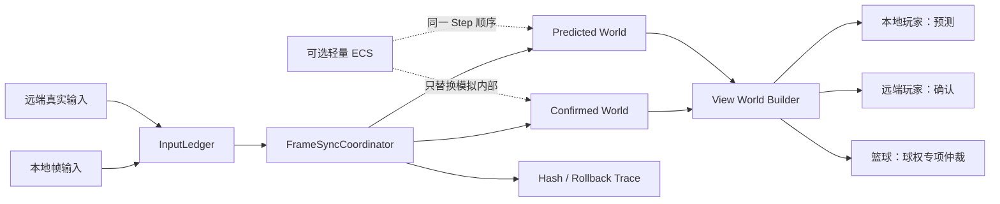

# 街篮2式最小帧同步实现——执行路线

> 更新时间：2026-08-25
>
> 项目：Route C（Unity 2022.3.62f2）
>
> 核心目标：先复刻街篮2项目中有学习价值的帧同步结构，再将轻量 ECS 作为确定性模拟的内部升级。
>
> 详细架构：[StreetBall2 式最小帧同步架构](../docs/architecture/streetball2-minimal-frame-sync-v2.md)

---

## 1. 目标重新定义

Route C 不再以继续增加篮球玩法为主要方向，而以“街篮2式最小帧同步框架”为主要方向。

### 必须深入

- 完整输入、预测输入和确认输入的帧时间线；
- 确认世界、预测世界和表现世界的职责分离；
- 预测命中后的确认推进，以及预测失败后的快照恢复与重演；
- 本地玩家、远端玩家和篮球采用不同的表现数据源；
- 球权、传球和投篮等跨实体状态的最小专项仲裁；
- Stable Frame、WorldHash、回滚轨迹和网络故障注入；
- 正常推帧与回滚重演共享同一个确定性单帧入口。

### 保持简单

- 仍为 1v1；
- 比赛流程只保留 Playing、结束请求和精彩回放；
- 得分规则、玩家状态和篮球状态维持当前最小集合；
- 不扩展技能、AI、复杂属性、动画状态树、匹配和大厅；
- 网络仍以现有帧转发模型为基础，不在本阶段替换商用后端。

### 延后且可选

- 轻量 ECS 只作为确定性模拟的内部实现；
- 不以 Unity DOTS、Entities、Jobs、Burst 为前置条件；
- 不建设 Archetype、Chunk、通用查询语言或动态 System 插件框架。

> 术语纠正：这里的 Confirmed World 是“由双方完整输入确定性推演出的确认世界”，并不等于服务器权威状态。当前服务器只转发输入，不负责权威篮球模拟。

---

## 2. 当前基线与缺口

截至 2026-08-12，Route C 已具备：

- 定点数与确定性篮球模拟；
- 本地输入边沿捕获、网络帧映射和远端输入预测；
- 完整世界快照、预测错误检测、回滚恢复与重演；
- WorldHash、Stable Frame 和精彩回放；
- 本地/远端差异化插值、回滚表现纠正和远端目标水位；
- 对应的 EditMode 回归测试。

当前主要缺口：

- 确认进度和预测进度没有成为明确的一等时间线；
- 当前逻辑世界同时承担预测运行世界和最终状态来源；
- 输入确认、快照确认、回滚重演和表现采样尚未由统一协调模块封装；
- 远端固定播放延迟只能减少错误进入显示窗口的概率，不能保证其数据已经确认；
- ECS 尚未引入，但这不是当前可见回滚的根因。

---

## 3. 目标架构

帧同步模块面向上层只暴露：提交本地输入、接收远端真实输入、推进帧、读取表现结果和读取诊断信息。快照恢复、预测历史清理和重演范围均隐藏在模块内部。

---

## 4. 执行阶段

### P1-G：远端表现水位与纠正（当前收尾）

**目标：** 完成现有四端点表现缓冲、回滚历史原子替换和 100ms 轨迹验证。

**边界：** 这是表现优化，不把预测帧变成确认帧，也不替代三世界架构。

**完成门槛：**

- 现有 EditMode 测试全部通过；
- 0ms 与固定 100ms 双端验证完成；
- 记录残余回滚的帧号、重演长度、显示窗口和最大反向位移；
- 不以“看起来更丝滑”代替量化验收。

### P2-A：统一确定性世界与单帧入口（已完成）

**目标：** 建立可复制的 `SimulationWorldState`，让正常推帧和回滚重演只调用一个 `DeterministicSimulation.Step`。

**内容：** 明确同步字段，集中 Capture/Restore/Hash，从 `PredictionSystem` 移出篮球快照拼装；保持玩法、协议和表现不变。

**验收：** 同一初始世界和输入序列，连续运行与中途恢复重演的最终状态逐字段相同且 Hash 相同。

**已实现：** `SimulationWorldState` 是唯一值类型同步状态；`WorldStateCodec` 集中负责实体与状态的 Capture/Restore；`DeterministicWorld` 统一正常推帧和回滚重演的 Step/Capture/Restore。`FrameSnapshot` 只保存一份 `world`，旧字段名均为同一存储的兼容访问器；等价状态沿用 `WorldHash.SchemaVersion = 2` 与既有字段顺序。

**验证状态：** 连续运行与中途恢复的 20 帧运动、拾球、持球移动、投篮和腾空轨迹逐字段及 Hash 一致；全量 EditMode 268/268 通过，Unity 独立编译通过，0ms 双端长时间采样的 6922 个共同帧 Hash 零失配。人工双端冒烟确认最终状态一致，移动、球权及其他同步状态正常；固定 100ms 下仍存在 P1-G 已知画面回抽，但没有新增状态或玩法异常。P2-A 不承诺解决该表现问题，后续仍按 P2-B～P2-D 分阶段改变确认进度与远端表现数据来源。

### P2-B：输入账本与确认帧头

**目标：** `FrameInputLedger` 显式记录每帧每名玩家输入的 Missing、Predicted、Actual 状态。

**内容：** 计算 `ConfirmedThroughFrame`，逐帧比较预测，集中瞬时按键预测规则，分离历史容量和确认进度。

**验收：** 乱序、重复、延迟和失配均得到唯一、可测试的确认帧头与最早错误帧。

### P2-C：确认世界与预测世界

**目标：** `FrameSyncCoordinator` 同时维护 Confirmed World 和 Predicted World。

**内容：** 确认世界只消费双方 Actual；预测世界消费 Actual/Predicted；失配后从确认快照恢复并重演；`GameController` 仅保留 Unity 生命周期和 Adapter 职责。

**验收：** 网络恢复后，两端 Confirmed World 在同一 canonical frame 上逐字段与 Hash 一致；Predicted World 可暂时分叉但必须收敛。

### P2-D：表现世界与篮球专项仲裁

**目标：** `ViewWorldBuilder` 生成只读表现状态，最小复刻街篮2的差异化表现策略。

**规则：**

- 本地玩家读取 Predicted World；
- 远端玩家读取 Confirmed World并插值；
- 篮球按球权语义选择来源；
- 远端获得球权确认后才附着；
- 本地投篮允许即时离手，预测失败时有限时长收敛；
- 表现状态绝不写回逻辑世界。

**验收：** 固定 100ms、输入突变和 3～5 帧回滚下，远端逻辑纠正不直接成为 Transform 回抽；人球切换无提前附着、延迟解绑或旧持有者残留。

**当前实现（2026-08-13）：** `ViewWorldBuilder` 以值快照生成只读 View World；本地选 Predicted，远端选 Confirmed，确认帧头未前进时远端冻结在最新端点。篮球已覆盖远端确认附着、远端未确认不提前附着、本地预测持球和本地明确脱手。回滚后重建 View 值，稳定高光/终局仍走 Confirmed 链路。

**自动化状态：** View World `15/15`、表现专项 `97/97`、全量 EditMode `344/344`；Unity 独立编译 0 错误，NetworkServer barrier PASS，Windows x64 构建 Success。Confirmed 历史前端点过期采用显式单端点降级，无效 holder 在 View 值和最终表现样本两层都不发布为附着；球权附着、脱手或持有者切换采用最长 0.2 秒的既有纠偏窗口，超过 2 单位阈值时显式 snap。该阶段记录时双端画面仍待人工验收；后续 P2-E 已完成固定 100ms 人工矩阵，最终结论见 P2-E 状态，不以本段早期数字替代后续验收。

### P2-E：网络实验室与诊断闭环

**目标：** 延迟、抖动、乱序、重复和丢包可确定性复现。

**内容：** 记录 actual/predicted、三条帧头、回滚起点和长度、显示窗口覆盖、两类 Hash，以及最大反向位移和收敛耗时。

**验收：** 相同种子和输入脚本产生相同故障与回滚轨迹，所有测试最终确认 Hash 收敛。

**当前实现（2026-08-17）：** 已完成纯确定性故障决策、服务端单包到期调度、稳定发送方顺序、应用层乱序/重复、TCP 恢复延迟模型、决策/时序双 trace、客户端到达元数据与只读诊断侧车。100ms 旧周期排空的接收 gap p50 约 `0.15ms`、最大突发 `4`；新调度约 `30.98ms`、最大突发 `1`。同 seed `771` 的两次 24 包决策 JSONL SHA-256 相同。

低延迟 Confirmed 播放订正已实施：默认 `TargetReadyBacklog = 0`，水位 `1` 仅为稳定优先可选模式；容量 `8`，第 9 个完整待播区间触发显式 Overflow；基于 Alpha 的分数积压驱动 `0.15` 增益、最大 `1.5x` 的平滑/迟滞追赶。Underflow 保持最后 Confirmed 端点；PresentationFault 只停止表现轨；长渲染帧记录跨区间与丢帧计数；回滚重算播放速度；玩家、篮球、holder、Alpha 与纠正基线原子换相。Actual 到首次可见、目标/容量、水位、倍速、降级和球来源切换均可由默认关闭的只读诊断侧车记录。本地仍用 Predicted，远端仍用 Confirmed，篮球仲裁不变。

**自动化与人工状态：** 订正后 P2-E focused EditMode `152/152`、全量 EditMode `410/410`，失败/跳过均为 `0`；独立 Unity 导入/编译返回码 `0`，Windows x64 构建 Success，服务端 lab 与 barrier/双向分片 frame-0 门禁 PASS。机器没有 .NET SDK，原 `dotnet build` 命令不可用；使用 Unity 随附 Mono/Roslyn 对相同 csproj 源文件进行 C# 7.3 等价编译成功。2026-08-17，帅老大在固定 `100ms` 单向注入延迟、60/144 FPS 双端、每场至少 10 秒的矩阵下完成最终人工验收并报告通过，覆盖启动、持续移动、停止、八方向、持球、抢断/holder 转换与投篮/脱手。人工原始诊断数值未随结论提供，不虚构 p50/p95。P2-E 已完成 Route C 验收；参数不代表《街篮2》真实参数。

### P2-F：UDP/KCP 实验通道（已完成）

**目标：** 在不改变既有 8 字节输入协议、Ledger 和三世界职责的前提下，引入 KCP 传输、显式 TCP 回退、受控重连与有界局内续连。

**边界：** Unity 主线程只依赖 `IFrameTransportClient`；Socket、KCP 与 worker 属于传输层。服务端解码发送方 KCP 后，只把 `raw + canonical frameID` 业务输入交给接收方自己的 KCP Session 编码，不转发客户端 KCP 数据报，不传输世界、快照或 Hash。Raw UDP 保持独立演示，不具备 KCP 的 ACK、重传、拥塞/窗口、重连或端点迁移能力。

**续连：** secret、session/attempt 身份及最新业务进度共同认证；成功时绑定新端点、递增 Generation，并仅回放不可变历史中的必要帧。宽限过期显式失败为 `ResumeGraceExpired`，历史不足显式失败为 `UnsafeResume`，不静默拼接不同时间线。

**自动化状态（2026-08-25）：** focused `257/257`、全量 EditMode `682/682`，失败/跳过均为 `0`；独立导入/编译 0 C# error，Windows x64 Player 构建成功。net48 Release 服务端为 `142848` 字节，SHA-256 `283770E3ECC5D2F13C3B1E4262563D3AEDE388407B90753F176D237AE14DA7A7`；TCP lab/barrier、KCP 纯协议 11 组、clean/reconnect/grace-expired/history-expired 真实 Socket 与 12 轮 interval matrix 全部 PASS。虚拟链路和真实 Socket 是不同证据层，前者不能替代端口、worker、PID 清理与端口释放验证。

Task 11 在当前 Windows loopback、33ms 逻辑节拍、每端 900 帧与 2% 上行 UDP 数据报丢失的预声明三轮中位数上选择 `10ms`。Task 12 保留该默认，但 fresh 样本中 5ms 的 p99 和 CPU 低于 10ms；因此它只代表当前机器与实验条件下的工程选择，不代表《街篮2》默认，也不构成跨环境速度结论。kcp2k 固定为 commit `66efda6686f649838d42f078fbaabf56ac449de4` 的纯 Core；见 [LICENSE](Frame%20Synchronization/Assets/ThirdParty/kcp2k/LICENSE)、[NOTICE](Frame%20Synchronization/Assets/ThirdParty/kcp2k/NOTICE.md) 与 [PATCHES](Frame%20Synchronization/Assets/ThirdParty/kcp2k/PATCHES.md)。

**验收：** 自动化门禁、Release 构建和版本化服务端替换已完成。2026-08-25，帅老大明确宣布 `P2-F 验收完成`；因此 P2-F 自动化、交付构建、独立审查及帅老大人工验收均已完成。该人工结论不附带未提供的主观评分、p50/p95、画面位移或详细操作次数；Unity endpoint 迁移画面仍未人工演示，协议级续连边界由真实 Socket probe 证明。

### P2-G：轻量 ECS（可选深化，本轮主动延后）

**前置：** P2-A～P2-F 完成且帧同步行为稳定。

**目标：** 只替换 `DeterministicSimulation` 内部，不改变帧同步接口。

**最小组成：** 稳定 Entity ID；Transform、Movement、Player、Possession、BallMotion 状态；固定 System 顺序 Input → Movement → Possession → Shot → BallPhysics → MatchFlow → Invariant；结构化 Clone/Restore/Hash。

**不做：** Unity DOTS、Archetype、Chunk、Jobs、Burst、运行时 System 注册和反射扫描。

**验收：** 旧模拟 Adapter 与 ECS Adapter 对相同输入逐帧产生相同规范化世界和 Hash。

**当前决策：** P2-G 本轮主动延后/暂不进入，不影响已经完成的帧同步闭环和 P2-H 作品集收口。不得把尚未实现的 ECS、DOTS、Jobs、Burst、Archetype 或 Chunk 写成当前项目能力。

### P2-H：收口与作品集证据（进行中）

**产物：** 作品集入口、架构与案例导航、可追溯证据、简历与面试口径、约 5 分钟演示脚本，以及明确的能力限制。P2-H 只收口已完成工程，不新增协议、玩法或 ECS；在帅老大实际完成作品集人工验收前，只能标记为进行中或“文档准备完成，等待验收”。

---

## 5. 学习检查点

| 阶段 | 必须掌握的问题 |
|---|---|
| P2-A | 哪些字段属于同步世界，为什么正常推帧和重演必须共用一个 Step？ |
| P2-B | 缓冲容量、预测跨度和确认帧头为什么是三个概念？ |
| P2-C | 确认世界与预测世界何时一致，何时允许暂时不一致？ |
| P2-D | 为什么本地、远端和篮球不能机械读取同一时间线？ |
| P2-E | 最终 Hash 收敛为什么不能证明中间从未预测分叉？ |
| P2-F | 传输层如何只搬运既有业务输入，续连为何必须验证身份、进度和历史边界？ |
| P2-G | ECS 改变哪一层，为什么不应改变帧同步接口？ |

---

## 6. 总体验收

- [x] 正常推进和回滚重演使用唯一确定性单帧入口；
- [x] 输入来源、确认帧头、预测帧头和表现帧头可独立观察；
- [x] Confirmed World 不消费预测输入；
- [x] Predicted World 可恢复、可重演、可收敛；
- [x] 本地、远端和篮球的表现来源规则具有自动测试；
- [x] 100ms、抖动、乱序和重复包可确定性复现；
- [x] 双端在同一 canonical confirmed frame 上 WorldHash 一致；
- [x] 逻辑回滚和表现连续性分别验收；
- [x] P2-G 之前不因 ECS 扩张学习范围；
- [ ] 比赛流程、得分和玩家状态保持当前最小复杂度。

## 7. 执行纪律

1. 先完成 P1-G 验收，再进入 P2-A。
2. 每阶段先写设计和失败测试，再做最小实现。
3. 一次只迁移一条职责，契约测试通过后再替换旧路径。
4. 确定性、回滚正确性和表现连续性不能互相替代。
5. P2-A～P2-E 不增加玩法复杂度；玩法需求单独排期。
6. 所有提交与 push 均由帅老大决定，禁止自动 push。

## P2-B 当前实现状态修订（2026-08-13）

P2-B 已实现唯一的 `FrameInputLedger`：它按 canonical frame 记录双方 `Missing`、`Predicted`、`Actual`，连续双 Actual 才推进确认头。网络客户端只保留带帧号 FIFO；`GameController` 映射后写入 Ledger。模拟、最早错预测、不可变回放计划、回放提交及稳定实际输入均以 Ledger 为唯一事实。

`FrameSyncCoordinator` 已完成 P2-C 双世界：唯一 Ledger 驱动独立 Confirmed/Predicted 运行世界和快照轨；Confirmed 逐帧只消费双方 Actual，Predicted 消费 Actual/Predicted；失配以最新 `ConfirmedFrame` 为基线重演未确认后缀，历史预检失败不推进任一帧头。`GameController` 只保留 Unity 生命周期、网络映射和表现 Adapter 职责；稳定高光、终局恢复与收敛 Hash 使用 Confirmed。

`PredictionSystem` 仅作为旧快照兼容门面保留，`FrameBuffer` 仅作执行日志；历史由 Ledger 的显式边界保留，不是固定 120 帧裁剪。P2-D `ViewWorldBuilder` 与篮球表现源仲裁已完成自动化验收。P2-E 网络实验室、低延迟 Confirmed 播放订正和双端固定 100ms 人工验收均已通过。P2-F UDP/KCP 实验通道的自动化、Release 构建、版本化服务端替换、独立审查与帅老大人工验收均已完成；P2-G 轻量 ECS 本轮主动延后；P2-H 作品集收口进行中。
