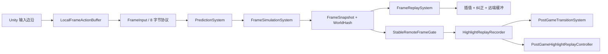

# Route C 帧同步架构

## 数据流

## 模块职责

| 模块 | 职责 | 不负责 |
|---|---|---|
| `FrameEngine` | 以逻辑帧推进输入、模拟和帧缓冲，暴露表现插值进度 | 篮球规则和网络协议 |
| `PredictionSystem` | 预测远端输入、保存完整世界快照、恢复指定帧 | 直接修改表现对象 |
| `FrameSimulationSystem` | 按固定顺序执行移动、投篮、球物理和拾取 | 读取墙钟时间或 Unity Transform |
| `FrameReplaySystem` | 从纠正点恢复后，使用确定输入重演后续帧 | 平滑视觉跳变 |
| 表现组件 | 本地即时表现、远端一帧缓冲、插值与回滚纠正平滑 | 写入同步世界状态 |
| 稳定帧组件 | 确认远端输入已验证，按连续稳定帧采集精彩片段 | 使用未纠正预测帧生成回放 |
| `PostGameTransitionSystem` | 恢复双方共同发布的终局帧，保证原子进入回放 | 自行选择本地当前帧 |
| `NetworkServer` | 等待两名客户端到齐、放行同一会话并转发固定长度输入帧 | 运行权威篮球模拟 |

## 确定性状态边界

同步状态只包含帧编号、定点数位置与速度、球员状态、持球标记、篮球状态及持球者。模拟不读取 `Time.deltaTime`、Transform 浮点值或本机按键持续状态。墙钟时间、浮点插值、摄像机和 GUI 均留在表现层。

输入边沿先由 `LocalFrameActionBuffer` 按渲染帧捕获，再消费进 8 字节 `FrameInput`。这样即使一个渲染帧内推进多个逻辑帧，`E`、`Space` 松开和 `F9` 也不会被重复触发。

## 预测、纠错与回滚

远端输入缺失时使用零输入预测。真实输入到达且不一致时，系统恢复错误帧之前的完整 `FrameSnapshot`，用真实输入重演到当前帧。完整快照覆盖球员位置、朝向、状态、持球标记，以及篮球位置、速度、状态和持球者，避免只恢复坐标造成隐藏状态分叉。

`WorldHash` 对规范化帧号和同步字段执行 FNV-1a 64 位计算。网络帧通过 Canonical Frame 映射到本地统一时间线，日志和哈希比较使用同一帧语义。

## 表现与精彩回放

逻辑层立即产生确定结果；表现层对本地球员保持低延迟，对远端球员额外缓冲一帧，并在回滚后平滑追赶。精彩片段只消费连续稳定快照。收到同步的 `F9` 后，记录器等候所有待收尾片段完成，发布唯一 `PostGameTerminalFrame`；进入回放前，两个客户端都恢复该帧快照，再暂停逻辑世界。
