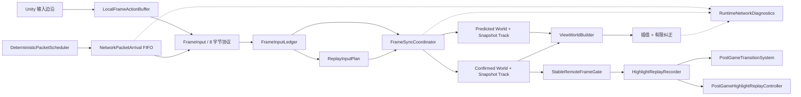

# Route C 帧同步架构

> 本文描述当前已实现架构。目标设计见 [StreetBall2 式最小帧同步架构](streetball2-minimal-frame-sync-v2.md)。P2-B 的 InputLedger、P2-C 的 Confirmed/Predicted 双世界、P2-D 的只读 View World、P2-E 的网络实验与低延迟 Confirmed 播放，以及 P2-F 的 UDP/KCP 实验通道、受控重连与有界局内续连均已实现。2026-08-25，帅老大宣布 P2-F 人工验收完成；P2-G 轻量 ECS 本轮主动延后，P2-H 作品集收口进行中。

## 数据流

## 模块职责

| 模块 | 职责 | 不负责 |
|---|---|---|
| `FrameEngine` | 以逻辑帧推进输入、模拟和帧缓冲，暴露表现插值进度 | 篮球规则和网络协议 |
| `FrameInputLedger` | 保存双方 Actual/Predicted、连续确认头、最早失配、回放计划与安全淘汰边界 | 保存世界状态或决定表现采样 |
| `FrameSyncCoordinator` | 拥有唯一 Ledger、Confirmed/Predicted 世界及独立快照轨，统一推进与重演 | 选择 P2-D 表现数据源 |
| `PredictionSystem` | 仅作为旧快照 API 兼容门面 | 参与 `GameController` 运行时推进 |
| `FrameSimulationSystem` | 按固定顺序执行移动、投篮、球物理和拾取 | 读取墙钟时间或 Unity Transform |
| `FrameReplaySystem` | 从纠正点恢复后，使用确定输入重演后续帧 | 平滑视觉跳变 |
| `ViewWorldBuilder` | 以 canonical 帧的值快照生成本地 Predicted、远端 Confirmed 与球权仲裁结果 | 运行第三份玩法或写回逻辑世界 |
| 表现组件 | 消费 View 值端点，插值并对来源/附着切换做有限时长纠正 | 写入同步世界状态 |
| 稳定帧组件 | 确认远端输入已验证，按连续稳定帧采集精彩片段 | 使用未纠正预测帧生成回放 |
| `PostGameTransitionSystem` | 恢复双方共同发布的终局状态；若 Confirmed 已领先录制终局，则使用最新 Confirmed 帧 | 自行选择本地当前帧或回退 Confirmed 帧头 |
| `NetworkServer` | 等待两名客户端到齐、按单包到期时间转发固定长度输入帧，并可确定性注入抖动、应用层乱序、重复与恢复延迟 | 运行权威篮球模拟或永久删除 TCP 消息 |
| `RuntimeNetworkDiagnostics` | 可选记录到达间隔、FIFO 排空、三条帧头、回滚、Hash 与远端表现位移 | 持有 Ledger、世界、快照或修改 Transform |

## 确定性状态边界

同步状态只包含帧编号、定点数位置与速度、球员状态、持球标记、篮球状态及持球者。模拟不读取 `Time.deltaTime`、Transform 浮点值或本机按键持续状态。墙钟时间、浮点插值、摄像机和 GUI 均留在表现层。

输入边沿先由 `LocalFrameActionBuffer` 按渲染帧捕获，再消费进 8 字节 `FrameInput`。这样即使一个渲染帧内推进多个逻辑帧，`E`、`Space` 松开和 `F9` 也不会被重复触发。

## 预测、纠错与回滚

远端输入缺失时，Ledger 按前一份 Actual 输入生成瞬时按键已清除的 Predicted 输入。真实输入到达且不一致时，系统恢复最新 Confirmed 快照，重演 `ConfirmedFrame + 1..PredictedFrame`。完整快照覆盖球员位置、朝向、状态、持球标记，以及篮球位置、速度、状态和持球者，避免只恢复坐标造成隐藏状态分叉。

`WorldHash` 对规范化帧号和同步字段执行 FNV-1a 64 位计算。网络帧通过 Canonical Frame 映射到本地统一时间线，日志和哈希比较使用同一帧语义。

## 表现与精彩回放

逻辑层立即产生确定结果；表现层对本地球员保持 Predicted 低延迟，对远端球员播放 Confirmed 区间。远端播放默认目标待播水位为 `0`，水位 `1` 仅为可选稳定优先模式；分数积压、平滑/迟滞追赶与显式降级负责吸收到达波动。精彩片段只消费连续稳定快照。收到同步的 `F9` 后，记录器等候所有待收尾片段完成，发布唯一 `PostGameTerminalFrame`；进入回放前，两个客户端都恢复该帧快照，再暂停逻辑世界。

## P2-D 当前实现状态（2026-08-13）

当前 P2-B 已采用唯一的 `FrameInputLedger`：按 canonical frame 保存双方 `Missing`、`Predicted`、`Actual` 输入，且仅连续双 Actual 推进确认头。网络客户端仅输出带帧号 FIFO，`GameController` 映射后写入 Ledger；不存在第二份远端输入字典。正常模拟、最早错预测、不可变回放计划、回放提交和稳定实际输入均以 Ledger 为唯一输入事实。

`PredictionSystem` 仅保存和恢复完整快照；`FrameBuffer` 仅为执行日志，不能作为输入、预测或回放来源。历史保留由 Ledger 的显式边界管理，而非固定 120 帧裁剪。

`FrameSyncCoordinator` 现为运行时唯一帧同步核心所有者：它持有唯一 Ledger、两套不共享实体/FSM/篮球实例的 DeterministicWorld，以及互相独立的 Confirmed/Predicted 快照轨。Predicted 每帧消费 Actual/Predicted；Confirmed 只逐帧消费双 Actual，确认头跨洞时虽然可在一次调用中追赶多帧，但每帧仍单独读取输入、调用唯一 `DeterministicWorld.Step` 并保存快照。

失配后，协调器以最新 `ConfirmedFrame` 为唯一恢复基线，使用一份不可变 Ledger plan 重演 `ConfirmedFrame + 1..PredictedFrame` 后缀，成功后才提交。历史预检失败时不推进任一帧头。

`ViewWorldBuilder` 现从协调器的值快照构建只读 `ViewWorldState`：本地球员使用 Predicted 端点，远端球员使用 Confirmed 端点；Confirmed 帧头未前进时远端冻结在最新端点，不重放旧区间。远端预测抢球不提前附着，远端确认持球才使用 Confirmed 附着；本地预测持球与明确脱手使用 Predicted。回滚后重建 View 值，不再将已撤销的 Predicted 远端样本送入实时显示。稳定高光与终局继续使用独立 Confirmed 链路。

P2-D 自动化证据为 View World `15/15`、表现专项 `97/97`、全量 EditMode `344/344`，独立导入/编译 0 错误，NetworkServer barrier PASS，Windows x64 构建 Success。Confirmed 前端点因容量淘汰时显式复制最新端点；无效 holder 在 View 值和最终表现样本两层都不发布为附着。附着、脱手或持球者切换会使用既有最长 0.2 秒纠偏窗口，达到 2 单位阈值时显式 snap。这些证明来源仲裁、边界与回归测试通过，不等于画面已验收；固定 100ms、3～5 帧失配、球权切换和终局画面仍待双端人工观察。这是 P2-D 完成时的基线，后续 P2-E 状态见下一节。

## P2-E 当前实现状态（2026-08-17）

服务端已由“固定周期唤醒并排空整批队列”改为单一单调时钟调度器。每个输入包按自身入队时间计算到期时间；同一发送方默认保持可靠顺序，只有明确标记的应用层乱序可越过阻塞。所谓丢包采用“确定性恢复延迟 + 同发送方队头阻塞”建模，因为真实 TCP 丢包会重传，永久删除应用消息会让 Ledger 留下永久确认洞。8 字节协议、双客户端共同放行和 `TcpClient.NoDelay` 均未改变。

`NetworkLabProfile` 与 `DeterministicNetworkFaultModel` 只以种子、发送方、发送序号、帧号和 raw 输入生成决策，不读取墙钟或线程顺序。决策 JSONL 不含运行时间；时序 JSONL 单独记录入队、到期、实际发送、批次和迟到量。两次 seed `771`、24 包的决策文件 SHA-256 完全相同；时序文件保持非确定性。

客户端 FIFO 现携带接收序号和单调时间戳，旧的 raw/frame 取包接口仍作为兼容包装。`RuntimeNetworkDiagnostics` 默认关闭，可由 Inspector 或 `-p2eDiagnostics` 开启；它只向日志输出接收间隔、单次排空量、Confirmed 增量、Predicted/Confirmed/View 帧头、回滚与确认 Hash、远端位移/反向位移/静止时长，不拥有第二份 Ledger 或逻辑世界。

旧 100ms 服务端实测为接收间隔 p50 约 `0.15ms`、最大突发 `4`；新调度器为延迟 p50 约 `106.56ms`、接收间隔 p50 约 `30.98ms`、最大突发 `1`。新版 0/200ms 的接收间隔 p50 分别约 `32.99ms`/`31.46ms`，最大突发均为 `1`。网络实验室阶段自动化证据为故障模型 `8/8`、诊断/所有权 `13/13`、回放收敛 `2/2`、全量 EditMode `362/362`、编译 0 错误、服务端调度与 barrier 均 PASS、Windows x64 构建 Success。

低延迟订正已将初版固定一帧常驻等待替换为可配置的 `ConfirmedPlaybackSettings`：默认 `TargetReadyBacklog = 0`，水位 `1` 仅为稳定优先可选模式，`MaxReadyBacklog = 8`。`ConfirmedPresentationCursor` 以 Alpha 计算分数积压，使用平滑/迟滞倍速控制；单个待播区间经 `0.10s` 资格窗口后追赶，两个及以上区间立即追赶。Underflow 保持最后 Confirmed 端点；第九个完整待播区间触发 Overflow 原子重基；快照缺失只进入 `PresentationFault`，不暂停逻辑世界；长渲染帧只提交最终样本并记录跨越与丢帧计数。回滚会重建表现值并重算播放速度，远端玩家、Confirmed 篮球、holder、Alpha 与纠正基线保持同一相位。本地玩家仍使用 Predicted，远端玩家仍使用 Confirmed，篮球来源仲裁、协议、Ledger、确定性世界、快照规范状态、WorldHash 和玩法均未改变。

诊断侧车继续默认关闭，并新增目标/容量只读副本、待播水位、分数积压、播放倍速、Underflow/Overflow/Fault、长帧丢弃、球来源切换，以及 canonical 映射后的 Actual 到首次可见记录。Actual 首次到达缓存有界，首次可见只记录一次；诊断数据不写回 Ledger、世界、快照、View 值或 Transform。

订正后的自动化证据为 P2-E focused EditMode `152/152`、全量 EditMode `410/410`，失败和跳过均为 `0`；独立 Unity 导入/编译返回码 `0`，Windows x64 构建结果为 Success；服务端 lab 与 barrier/双向分片 frame-0 门禁均 PASS。当前机器缺少 .NET SDK，原定 `dotnet build` 命令无法执行；使用 Unity 随附的 Mono/Roslyn 以 C# 7.3 编译相同 `NetworkServer.csproj` 源文件成功，不能把这项等价编译描述成原命令通过。

2026-08-17 由帅老大执行最终人工验收并报告通过。验收基线为固定 `100ms` 单向注入延迟、60/144 FPS 双端，每场至少 10 秒，覆盖启动、持续移动、停止、八方向、持球、抢断/持球者转换与投篮/脱手；通过判据包括本地立即响应、默认水位 `0` 不再增加完整帧等待、无周期性停走/前跳/回抽/持续快进，以及人球关系正确。人工原始诊断数值未随结论提供，因此本文不虚构 p50/p95 等数值。综合自动化、构建/服务端门禁与最终人工结论，**P2-E 已完成 Route C 验收。** 这些数值只是 Route C 初始实验参数，不代表《街篮2》真实参数。P2-F 的后续状态见下文。

## Raw UDP minimal Demo（2026-08-20）

当前网络门面提供三种彼此独立的传输选择：`tcp` 保留 P2-E 的可靠字节流与 `tcp-recovered-loss-hol/application` 实验语义；`kcp` 是 P2-F 的 UDP/KCP 实验通道；`raw-udp` 是独立的最小 1v1 无连接数据报演示。Raw UDP 的窗口、PacketSequence、gap grace 和诊断标签不进入 KCP；KCP 的 ACK、重传、拥塞/窗口、Generation 和 Resume 也不得写成 Raw UDP 能力。

Raw UDP 使用 `Hello/Welcome/Ready/Start` 屏障，从 canonical frame `0`、`RemoteFrameOffset = 0` 启动。每个 `RawInput` 携带最近 N 帧的完整输入窗口，默认 `N=6`、可选 `N=1..16`；稳定 N=6 数据报为 `88` 字节，N=16 最大为 `168` 字节。服务端只保存每名玩家 256 帧不可变输入历史并重建对端数据报，不运行篮球世界、预测、回滚、快照或表现逻辑。远端 Actual 仍由现有 `GameController -> FrameSyncCoordinator -> FrameInputLedger.RecordActual` 路径发布，Ledger 仍是唯一事实源。

Raw UDP 明确没有 ACK、bitmap、选择性重传、拥塞控制、重连、恢复或端点迁移。下行 opportunity count 只表示服务端生成了包含某帧的数据报，不表示送达或确认。连续丢失少于 N 个对齐机会可由冗余窗口补齐；缺帧越过 N 后再耗尽 16 个新序号 grace，会以相同 `UnrecoverableInputGap` 向双方终止。第一份 frame/raw 永久不变，同帧不同 raw 以 `ConflictingInput` 向双方终止。

确定性 Raw 实验模型只作用于完整数据报，决策身份由方向、短 session fingerprint、消息类型、copy index，以及输入 PacketSequence 或控制发送序号组成；delay、jitter、drop、reorder、duplicate 使用独立 salt。drop 永久删除该数据报，不伪造恢复；duplicate 最多增加一份副本。Raw 标签固定为 `raw-udp-datagram-*`，不复用 TCP recovered-loss/HOL 或 KCP 指标。

自动化证据为 Raw focused EditMode `77/77`、相关 EditMode `156/156`、全量 EditMode `614/614`，均为 0 failed、0 skipped；独立 Unity 导入/编译 0 个 `error CS`；net48/C# 7.3 编译 `58` 个源文件、输出 `116736` 字节；七个服务端套件、三组 TCP 时序回归与 11 场景真实双 Socket 矩阵均 PASS。live 矩阵每个非提前终止场景使用每端至少 900 个逻辑输入，并覆盖 N=16 的 168 字节上限、真实控制首包丢失重试、旧绑定端点超时以及每玩家单轮工作项不超过 64。这些是自动化协议与数据门禁，不是最终画面验收；人工画面接受仍由帅老大按演示步骤观察后决定。

## P2-F UDP/KCP 实验通道（2026-08-25）

P2-F 将代码级默认实验传输改为 `kcp`，保留 `tcp` 显式回退和 `raw-udp` 独立演示。版本化 `SampleScene` 当前仍序列化为 `RawUdp`，因此人工 KCP 验收必须先在 `NetworkClient` Inspector 明确选为 `KcpUdp`；本次场景修改不在 Task 12 范围内。Unity 主线程只依赖 `IFrameTransportClient`，Socket、KCP 状态和 worker 归传输层所有。服务端不直接转发客户端 KCP 数据报：它先把入站 payload 交给发送方 KCP 解码，得到既有 8 字节 `raw + canonical frameID` 后，再通过接收方自己的 KCP Session 编码发送。`FrameInputLedger` 仍是 Actual/Predicted/确认头和最早失配的唯一事实源；不传输世界状态、快照或 WorldHash。

受控重连以 Session、Generation、新 Endpoint 和不可见令牌完成身份切换。连续 3000ms 无有效流量后进入重连事实，5000ms grace 内可在不传输世界状态的前提下，使用双端和服务端的不可变 Actual 历史补传/重放并回到 Running。grace 过期或所需历史超出 256 帧有界能力时，双方显式收到 `ResumeRejected`，不静默拼接不同时间线。诊断只记录 fingerprint、Generation、计数和时序量，不记录 Token、Nonce、ResumeAttemptID 或原始 SessionID。

Task 11 在本机 Windows loopback、33ms 逻辑节拍、每端 900 帧、2% 上行 UDP datagram drop 的预声明矩阵上裁定 `10ms` 为 Route C 当前建议，Task 12 保留该默认并重跑最终 Release 二进制。fresh 12 轮中 1/5/10/20ms 全部 3/3 正确；10ms 的 relay p50/p95/p99 中位数为 `15.9993/30.8883/53.3266ms`，worker CPU 中位数为单核 `2.680308%`。这是当前机器和 loopback 调度下的实测裁定，不是《街篮2》原项目默认，也不是“KCP 必然快 X%”；Task 12 新样本中 5ms 的 p99 和 CPU 更低，正说明不应把单次机器数据当成跨环境定律。

Task 12 fresh 自动化证据为：vendor `4/4`、codec `35/35`、KCP session/history `35/35`、client state `28/28`、resume `27/27`、virtual link `54/54`、ownership `14/14`、focused 并集 `257/257`、全量 EditMode `682/682`，全部 0 failed/0 skipped；独立导入/编译 0 C# error；Windows x64 Player 构建成功。net48 Release 服务端为 `142848` 字节，SHA-256 `283770E3ECC5D2F13C3B1E4262563D3AEDE388407B90753F176D237AE14DA7A7`；TCP lab/barrier、KCP 纯协议 11 组、clean/reconnect/grace-expired/history-expired 真实 Socket 与 12 轮 interval matrix 全部 PASS。虚拟链路的 54/54 只证明确定性模型，live Socket 证据才证明真实端口、worker、CLI、PID 清理与端口释放。TCP control 的故障语义是 `tcp-recovered-loss-hol/application`，KCP 矩阵是 `udp-datagram-drop`，两者数字不直接混比。

kcp2k 只固定引入 commit `66efda6686f649838d42f078fbaabf56ac449de4` 的纯 Core，上游 MIT 条款见 [LICENSE](../../Project/Frame%20Synchronization/Assets/ThirdParty/kcp2k/LICENSE)，归属与引入边界见 [NOTICE](../../Project/Frame%20Synchronization/Assets/ThirdParty/kcp2k/NOTICE.md)，Route C 的 1/5ms interval clamp 实验补丁及哈希见 [PATCHES](../../Project/Frame%20Synchronization/Assets/ThirdParty/kcp2k/PATCHES.md)。

**当前结论：P2-F 已完成。** Task 12 自动化、Release/版本化交付、独立只读审查和帅老大人工验收均已完成。人工结论不虚构未提供的评分、p50/p95、画面位移或操作次数；真实 Socket probe 已验证 endpoint 变化与安全拒绝，但 Unity 画面中的 endpoint 迁移未人工演示，不能扩写为商业级断网重连。
