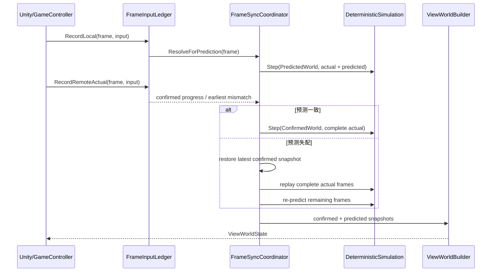
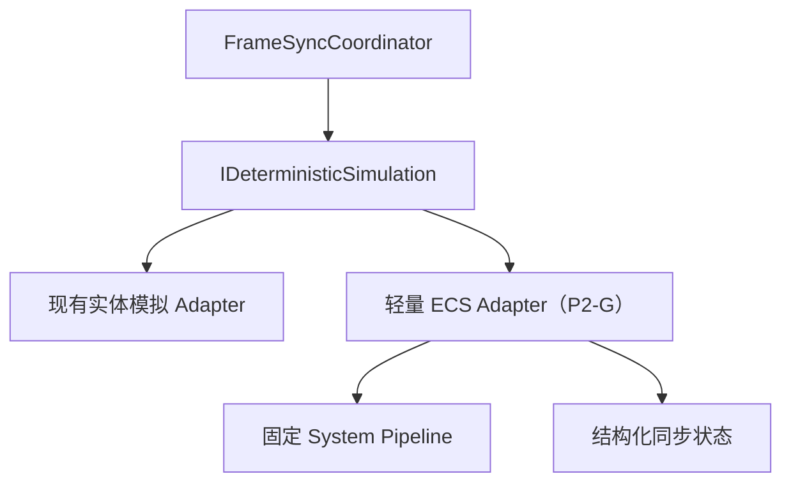

# StreetBall2 式最小帧同步架构

> 状态：P2-A～P2-F 已实现并完成对应验收；2026-08-25 帅老大宣布 P2-F 人工验收完成；P2-G 轻量 ECS 本轮主动延后；P2-H 作品集收口进行中
>
> 日期：2026-08-25
>
> 范围：Route C P2-A～P2-H

## 1. 设计结论

Route C 的下一阶段不是复刻街篮2全部业务代码，也不是先建设通用 ECS。目标是保留街篮2工程中对帧同步学习最有价值的结构：确认世界、预测世界、表现世界、逐帧预测验证、错误后重算，以及篮球的专项表现仲裁。

篮球玩法仍保持最小状态。轻量 ECS 只在帧同步闭环稳定后，作为确定性模拟内部的可替换实现加入。

## 2. 事实边界

### 当前 Route C 已验证存在

- `SimulationWorldState` 是完整、值类型且不含可变引用的唯一规范同步状态；
- `WorldStateCodec` 是运行时篮球实体与规范状态之间唯一的 Capture/Restore 映射；
- `DeterministicWorld.Step` 是正常推帧和回滚重演共享的世界模块入口，内部保持既有 `FrameSimulationSystem.Step` 的 System 顺序；
- `FrameSnapshot` 只保存一份 `SimulationWorldState world`，旧名称是访问同一存储的兼容访问器；
- `FrameInputLedger` 是双方 Actual、预测值、连续确认头、最早失配和回放计划的唯一输入事实源；
- `PredictionSystem` 只保存和恢复完整世界快照；
- `FrameReplaySystem` 从快照恢复并只消费 Ledger 生成的不可变计划重演；
- `PresentationFrameInterpolator` 和 `PresentationCorrectionSmoother` 处理表现缓冲与纠正；
- `ConfirmedPlaybackSettings` 与 `ConfirmedPresentationCursor` 以可配置水位、分数积压和显式降级控制 Confirmed 表现播放；
- `IFrameTransportClient` 隔离 Unity 主线程与 TCP、KCP、Raw UDP 传输实现；P2-F 代码级默认实验传输为 KCP，TCP 保留显式回退，Raw UDP 保持独立演示；版本化 `SampleScene` 当前仍序列化为 RawUdp，人工 KCP 验收须在 Inspector 明确切换；
- `StableRemoteFrameGate` 已用于稳定精彩回放帧；
- `WorldHash` 可比较规范化世界状态。

P2-A 人工双端冒烟已确认最终状态一致，移动、球权及其他同步状态正常。固定 100ms 下仍有 P1-G 已知画面回抽；这不否定回滚正确性，也不属于 P2-A 的表现优化范围。P2-A 当时的远端表现仍可能读取预测数据，随后已由 Confirmed World 与 View World 阶段改变数据来源。

### 街篮2参考源码中已验证存在

- `MatchController` 持有确认、预测和表现用途的多个 MatchEntity；
- `RemoteBattleController.ReCalculate` 比较预测队列与服务端到达帧，并在失配时重算；
- `MatchView.RenderUpdate` 对本地玩家、远端玩家使用不同状态来源；
- `BallView` 同时参考预测与确认状态，处理持球、传球和投篮表现；
- 其 Entity/Component/System 是业务型实体系统结构，不能直接等同于 Unity DOTS。

### 尚未实现或尚未验收，不得描述为当前能力

- Route C 尚未实现 P2-G 轻量 ECS Adapter；
- P2-E 的水位、增益、倍速和迟滞值只经过 Route C 验收，不得描述为《街篮2》真实参数；
- P2-F 自动化完成不等于双端画面平滑、手感、重连过程和异常终止已经人工通过。

## 3. 核心术语

| 术语 | 精确定义 | 不等于 |
|---|---|---|
| Actual Input | 对应玩家真实提交且已到达的某一帧输入 | 预测正确的输入 |
| Predicted Input | Actual 缺失时按规则生成的临时输入 | 已确认输入 |
| Confirmed Frame | 该帧双方输入均为 Actual，可推进确认世界 | 缓冲中最旧的帧 |
| Confirmed World | 只由完整 Actual 输入推演的世界 | 服务器权威状态 |
| Predicted World | 包含 Actual 与 Predicted 输入的低延迟世界 | 最终一定正确的世界 |
| View World | 从确认/预测快照组合出的只读表现模型 | 第三个确定性模拟世界 |
| Stable Frame | 按用途定义、不会再受相关预测纠正影响的帧 | 单纯延迟 N 帧的帧 |
| Rollback | 恢复历史快照并重演逻辑 | Transform 必然反向移动 |

## 4. 核心模块

### 4.1 DeterministicWorld（P2-A 已实现）

```csharp
public sealed class DeterministicWorld
{
    FrameSimulationResult Step(FrameInput[] inputs);
    SimulationWorldState Capture(int frameID);
    void Restore(in SimulationWorldState state);
}
```

P2-A 以现有实体模拟为运行载体，通过 `SimulationWorldState` 复制世界，并让正常执行与回滚重演只调用同一个世界模块。移动、持球、投篮、球物理和比赛流程的顺序没有改变。此实现不是 Confirmed/Predicted 双世界协调器，也不是 ECS Adapter。

### 4.2 FrameInputLedger

```csharp
public sealed class FrameInputLedger
{
    public int ConfirmedThroughFrame { get; }
    public void RecordLocal(int frameID, FrameInput input);
    public InputArrival RecordRemoteActual(int frameID, FrameInput input);
    public FrameInputSet ResolveForPrediction(int frameID);
    public bool TryGetConfirmed(int frameID, out FrameInputSet inputs);
}
```

该模块内部负责输入来源、预测策略、重复包、乱序包、最早失配帧和历史淘汰。容量不决定确认进度。

### 4.3 FrameSyncCoordinator

```csharp
public sealed class FrameSyncCoordinator
{
    public int ConfirmedFrame { get; }
    public int PredictedFrame { get; }
    public SimulationWorldState ConfirmedWorld { get; }
    public SimulationWorldState PredictedWorld { get; }

    public FrameAdvanceResult Advance(int frameID, FrameInput localInput);
    public ReconcileResult AcceptRemoteInput(int frameID, FrameInput input);
    public bool TryGetSnapshot(WorldTrack track, int frameID, out SimulationWorldState world);
}
```

这是帧同步核心的主要 Seam。上层不直接操作快照环形缓冲、预测历史或重演循环。

### 4.4 ViewWorldBuilder

```csharp
public sealed class ViewWorldBuilder
{
    public ViewWorldState Build(
        in SimulationWorldState confirmed,
        in SimulationWorldState predicted,
        int localPlayerIndex);
}
```

它只生成表现读模型，不更新 Transform，也不写回同步状态。Unity 表现 Adapter 只消费 `ViewWorldState`。

## 5. 数据流



## 6. 三世界规则

### Confirmed World

- 只消费双方 Actual 输入；
- 帧头不能超过 `FrameInputLedger.ConfirmedThroughFrame`；
- 用作远端玩家稳定表现、Hash 比较和预测恢复基线；
- 输入完整不代表服务器权威，只代表本地具备确定性推演所需事实。

### Predicted World

- 本地输入立即生效；
- 远端缺失输入使用集中定义的预测策略；
- 允许与另一客户端的临时预测世界不同；
- 收到失配 Actual 后从确认快照重建，不对当前位置做增量补丁。

### View World

- 是只读组合结果，不运行篮球逻辑；
- 本地玩家优先 Predicted；
- 远端玩家优先 Confirmed；
- 篮球按持球者与转换状态选择来源；
- 插值、误差衰减和动画时间均不参与 WorldHash。

## 7. 最小篮球仲裁矩阵

| 篮球语义 | 玩家来源 | 篮球来源 | 规则 |
|---|---|---|---|
| 本地确认/预测持球 | 本地 Predicted | Predicted 挂点 | 保证操作即时 |
| 远端预测获得球权 | 远端 Confirmed | 保持上一确认语义 | 不提前挂到远端手上 |
| 远端确认持球 | 远端 Confirmed | Confirmed 挂点 | 人球使用同一确认帧 |
| 本地预测投篮离手 | 本地 Predicted | Predicted Airborne | 立即离手；失配时纠正 |
| 远端投篮 | 远端 Confirmed | Confirmed Airborne | 确认后离手 |
| Free / Scored | 视对象策略 | Confirmed 优先 | 避免共享球受预测反复拉扯 |

仲裁矩阵必须由测试固定，不在 MonoBehaviour 中散落条件分支。

## 8. 回滚与确认算法

1. 每个渲染帧捕获一次本地输入边沿，按逻辑帧消费。
2. `FrameInputLedger` 为预测帧生成输入集并记录来源。
3. `PredictedWorld` 通过唯一 Step 推进并保存预测快照。
4. 远端 Actual 到达后，账本更新连续确认帧头。
5. 对已执行预测逐帧比较输入：一致则推进 Confirmed；失配则找到最早错误帧。
6. 从错误帧之前的确认快照恢复，使用 Actual 重演确认区间。
7. 使用新的预测输入重演剩余未确认区间。
8. 原子发布一次 `ReconcileResult`，表现层据此替换历史并启动有限纠正。

## 9. 轻量 ECS 的位置



只有 Legacy 与 ECS 两个 Adapter 都通过同一契约测试，这个 Seam 才有实际价值。ECS 不接触网络收包、预测队列、确认帧头或 Unity Transform。

## 10. 不变量

1. `ConfirmedFrame <= PredictedFrame`。
2. Confirmed World 的每个已执行帧都具有双方 Actual 输入。
3. 同一初始世界、输入序列和 System 顺序必须产生同一 Hash。
4. 正常推帧与重演不允许存在两套业务逻辑。
5. View World 不得写回 Confirmed/Predicted World。
6. 表现缓冲容量、播放水位和确认帧头必须独立配置和观测。
7. 最终 Confirmed Hash 收敛不证明中间 Predicted World 从未分叉。
8. 逻辑回滚正确不证明画面平滑，两类验收必须分开。

## 11. 诊断字段

每次 reconcile 至少记录：canonical frame；Confirmed、Predicted、View 帧头；失配玩家与输入 raw；最早失配帧、恢复帧和重演帧数；是否覆盖显示窗口；confirmed/predicted hash；表现最大单帧位移、最大反向位移和收敛耗时。

缺失快照、历史过期或输入不连续必须显式失败或采用文档化降级策略，不能静默拼接不同时间线。

## 12. 与街篮2概念对应

| 街篮2参考概念 | Route C 目标概念 | 简化方式 |
|---|---|---|
| confirmed `MatchEntity` | `ConfirmedWorld` | 两名玩家、篮球和最小比赛字段 |
| predict `MatchEntity` | `PredictedWorld` | 复用同一确定性 Step |
| view `MatchEntity` | `ViewWorldState` | 只读快照，不运行第三份业务模拟 |
| `RemoteBattleController.ReCalculate` | `FrameSyncCoordinator.AcceptRemoteInput` | 隐藏清理、恢复和重演 |
| `MatchView.RenderUpdate` | `ViewWorldBuilder` + Unity Adapter | View 不读取网络队列 |
| `BallView` 专项处理 | `BallPresentationPolicy` | 只覆盖 Held、Airborne、Free、Scored |
| Entity/Component/System | P2-G 轻量 ECS Adapter | 不复刻庞大业务和反射体系 |

## 13. 决策记录

- 选择架构等价复刻，不逐行仿写类名和调用链；
- 先完成三世界与表现闭环，再建设 P2-F 传输实验；轻量 ECS 延后到 P2-G，且本轮主动跳过以优先完成 P2-H；
- 保留当前 Route C 作迁移对照，契约测试通过后再替换旧职责；
- 不以玩法数量或 DOTS 复杂度衡量帧同步技术深度。

## P2-B 当前实现状态修订（2026-08-13）

`FrameInputLedger` 已是唯一输入事实：按 canonical frame 保存双方 `Missing`、`Predicted`、`Actual`，连续双 Actual 才推进确认头。网络层只保留带帧号 FIFO，`GameController` 负责映射并写入 Ledger；正常模拟、最早错预测、不可变回放计划、回放提交和稳定实际输入均使用 Ledger。

`FrameSyncCoordinator` 已实现 Confirmed/Predicted 双世界：两条轨道不共享可变运行时对象或快照缓冲；Confirmed 只消费双方 Actual，Predicted 消费 Actual/Predicted，失配以最新 `ConfirmedFrame` 为基线完整重演未确认后缀。`GameController` 已收敛为 Unity/网络/表现 Adapter，稳定高光、终局恢复与收敛 Hash 使用 Confirmed 轨。

`PredictionSystem` 仅作为旧测试/兼容快照门面保留，运行时协调器使用 `WorldSnapshotStore`；`FrameBuffer` 只记录已执行输入，不能用于预测或回放。

P2-D 已实现只读 `ViewWorldState`/`ViewWorldBuilder`：本地球员选 Predicted，远端球员选 Confirmed，Confirmed 未前进时不重放旧表现区间。篮球按确认远端持球、本地预测持球与本地明确脱手选源；远端预测抢球不提前附着，无效 holder 在 View 值和最终表现样本两层都不形成附着。Confirmed 前端点因容量淘汰时复制最新端点并显式标记单端点来源。附着、脱手或持球者切换使用既有最长 0.2 秒纠偏窗口，达到 2 单位阈值时显式 snap。回滚重建 View 值而不向远端显示注入撤销的 Predicted 样本；实时 View 不污染稳定高光或终局 Confirmed 链路。P2-D 自动化为 View `15/15`、表现 `97/97`、全量 EditMode `344/344`、编译 0 错误、barrier PASS、Windows 构建 Success。视觉平滑仍须双端人工验收。

## P2-E 当前实现状态修订（2026-08-17）

P2-E 已实现共享的纯 C# `NetworkLabProfile`/`DeterministicNetworkFaultModel`、服务端单包到期调度器、稳定同发送方顺序、应用层乱序/重复和 TCP 恢复延迟模型。交互模式 `0/1/2` 仍对应 0/100/200ms；命令行可显式指定 delay、jitter、reorder、duplicate、recovered loss、seed 与两类 trace。决策 trace 只包含稳定标识和故障选择，观测 timing trace 才包含墙钟相关时间。

客户端用唯一 `ConcurrentQueue<NetworkPacketArrival>` 保存 raw、远端帧号、接收序号和单调时间戳；诊断侧车默认关闭，不写入 Ledger、世界、快照、View 值或 Transform。自动回放覆盖 0/100/200ms、抖动、应用层乱序、重复和恢复延迟；重复 Actual 保持幂等、确认洞填补前不越过连续确认头，故障结束后终止帧 Confirmed/Predicted Hash 相同。

旧 100ms 周期排空的接收 gap p50 约 `0.15ms`、最大突发 `4`，单包调度后约 `30.98ms`、最大突发 `1`。网络实验室全量 EditMode `362/362`，初版固定一帧 `ConfirmedPresentationCursor` 加入后全量 EditMode `368/368`；对应编译 0 错误、服务端 lab/barrier PASS、Windows x64 构建 Success。同种子两次 24 包决策 JSONL SHA-256 相同。

低延迟订正已采用默认水位 `0`、可选水位 `1`、容量 `8`、分数积压和平滑/迟滞追赶，并显式处理 Underflow、Overflow、长渲染帧、快照缺失、回滚速度重算和玩家—篮球原子相位。Underflow 保持最后 Confirmed 端点；Overflow 原子重基远端玩家、Confirmed 球、holder、Alpha 与纠正基线；快照缺失只停止 Confirmed 表现轨，不暂停逻辑世界。本地玩家继续读取 Predicted，远端玩家继续读取 Confirmed，篮球仍按 P2-D 规则仲裁。诊断默认关闭并新增水位、倍速、降级、球来源切换及 Actual 到首次可见记录，且不参与确定性状态或 Hash。

订正后的 P2-E focused EditMode 为 `152/152`，全量 EditMode 为 `410/410`，失败和跳过均为 `0`；独立 Unity 导入/编译返回码 `0`，Windows x64 构建 Success，服务端 lab 与 barrier/双向分片 frame-0 门禁 PASS。机器缺少 .NET SDK，原 `dotnet build` 未执行成功；以 Unity 随附 Mono/Roslyn 对同一 csproj 源文件进行 C# 7.3 等价编译成功，此限制保留在验收证据中。

2026-08-17，帅老大按固定 `100ms` 单向注入延迟、60/144 FPS 双端、每场至少 10 秒的矩阵执行最终人工验收并报告通过，覆盖移动启动/持续/停止、八方向、持球、抢断/holder 转换和投篮/脱手。人工原始诊断数值未随结论提供，因此不声明未记录的 p50/p95。P2-E 至此完成 Route C 验收；所有调参仍只是 Route C 初始实验参数，不代表《街篮2》真实参数。

## P2-F 当前实现状态修订（2026-08-25）

P2-F 已实现 UDP/KCP 实验通道、受控重连和有界局内续连。Unity 主线程只通过 `IFrameTransportClient` 消费业务消息；Socket、KCP 状态及 worker 留在传输层。服务端先用发送方 KCP Session 解码数据报，再把既有 8 字节 `raw + canonical frameID` 业务输入交给接收方自己的 KCP Session 编码；它不转发客户端 KCP 数据报，也不传输世界状态、快照或 WorldHash。`FrameInputLedger` 仍是双方 Actual、预测、确认头与最早失配的唯一事实源。TCP 是显式回退，Raw UDP 是独立的不可靠演示，三者的故障标签和能力边界不能互换。

续连凭服务器随机 secret、session/attempt 身份与最新业务进度认证；服务端绑定新端点、递增 Generation，并仅回放不可变历史中的必要帧。宽限过期显式返回 `ResumeGraceExpired`，历史不足显式返回 `UnsafeResume`，都不静默拼接时间线。secret 只作认证数据，不进入 JSON 证据或日志字段。

Task 12 fresh 证据为 focused `257/257`、全量 EditMode `682/682`，全部 0 failed/0 skipped；Unity 独立导入/编译 0 C# error，Windows x64 Player 构建成功。net48 Release 服务端为 `142848` 字节，SHA-256 `283770E3ECC5D2F13C3B1E4262563D3AEDE388407B90753F176D237AE14DA7A7`。TCP 门禁、KCP 纯协议 11 组、clean/reconnect/grace-expired/history-expired 真实 Socket，以及 1/5/10/20ms 各三轮矩阵全部 PASS。虚拟链路用例只证明确定性模型；真实 Socket 证据才覆盖 CLI、端口、worker、进程停止与端口释放。

Task 11 在当前 Windows loopback、33ms 逻辑节拍、每端 900 帧和 2% 上行 UDP 数据报丢失的预声明样本上选择 `10ms`；Task 12 继续把它作为 Route C 本机默认验证值。fresh 样本中 5ms 的 p99 和 CPU 反而低于 10ms，因此该选择是机器与实验条件相关的工程裁定，不代表《街篮2》参数，也不证明 KCP 普遍比 TCP 快固定比例。上游 kcp2k 固定为 commit `66efda6686f649838d42f078fbaabf56ac449de4` 的纯 Core，许可见 [LICENSE](../../Project/Frame%20Synchronization/Assets/ThirdParty/kcp2k/LICENSE)，边界见 [NOTICE](../../Project/Frame%20Synchronization/Assets/ThirdParty/kcp2k/NOTICE.md)，1/5ms clamp 补丁见 [PATCHES](../../Project/Frame%20Synchronization/Assets/ThirdParty/kcp2k/PATCHES.md)。

**当前结论：P2-F 已完成。** Task 12 自动化、Release/版本化交付、独立只读审查和帅老大人工验收均已完成。人工结论不包含未提供的主观量化数据；协议级 endpoint 迁移不等于 Unity 画面重连，更不等于客户端/服务端重启续局或商业级移动网络恢复。
