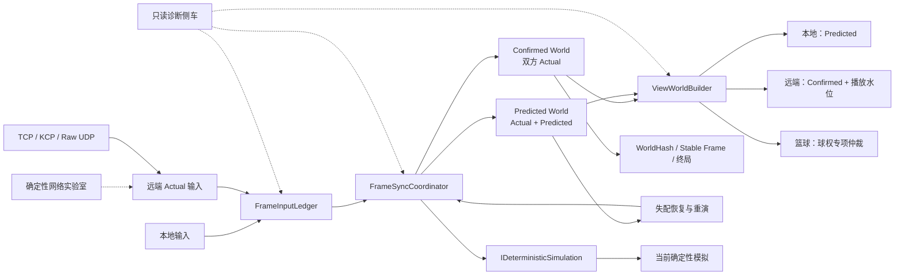

# 街篮2式帧同步框架：最终目标、验收证据与简历材料

> 项目：Route C / Unity 街篮帧同步最小框架
>
> 用途：P2-H 作品集、简历与面试口径的正式材料
>
> 口径：参考《街篮2》已验证的架构概念进行等价简化，不逐行复刻业务源码
>
> 状态：P2-F 已完成；P2-G 可选轻量 ECS 本轮主动延后；P2-H 进行中

---

## 1. 最终项目定位

Route C 的最终目标不是继续堆叠篮球玩法，而是在 Unity 2022.3 与 C# 环境中实现一套可运行、可回滚、可验证、可演示的街篮类帧同步框架。

框架围绕两名玩家、篮球、移动、持球、投篮和最小比赛流程，建立以下核心能力：

- 以 canonical frame 统一双方输入和世界状态的时间语义；
- 以 Actual、Predicted、Confirmed 明确区分输入事实与临时预测；
- 维护互相隔离的 Confirmed World 与 Predicted World；
- 预测失配时从确认快照恢复并重演未确认后缀；
- 通过只读 View World 组合本地、远端和篮球的不同表现来源；
- 将逻辑正确性、最终收敛和画面连续性分别验证；
- 在确定性网络实验室中复现延迟、抖动、乱序、重复和恢复延迟；
- 通过逐帧状态、WorldHash、故障轨迹和双端画面形成完整证据链；
- 以可插拔 TCP、KCP 与 Raw UDP 传输验证相同 8 字节业务输入在不同故障语义下的边界。

最终成果应证明：开发者不仅能“写出一个会回滚的 Demo”，还理解输入时间线、预测、确认、快照、重演、表现仲裁、网络故障和确定性验证之间的边界。

---

## 2. 必须保持准确的技术口径

### 2.1 Confirmed World 不是服务器权威世界

当前服务器只负责等待双方连接、转发输入和注入确定性网络故障，不运行篮球模拟。

Confirmed World 的“权威性”来自：同一 canonical frame 上双方输入均已成为 Actual，并且客户端使用同一确定性 Step 推演出一致结果。它不能在简历中写成“服务器权威状态同步”。

### 2.2 双世界不等于双端屏幕实时完全相同

每个客户端的表现策略是：

| 对象 | 表现来源 | 目标 |
|---|---|---|
| 本地玩家 | Predicted World | 操作立即生效，保持低延迟 |
| 远端玩家 | Confirmed World + 表现播放策略 | 不把未确认回滚直接显示为回抽 |
| 篮球 | 按球权与状态转换仲裁 | 保持人球语义一致 |
| Hash、稳定帧、终局 | Confirmed World | 使用已确认事实 |

因此，两端的临时 Predicted World 和实时画面允许不同；同一 confirmed canonical frame 的规范化世界与 Hash 必须一致。

### 2.3 平滑、回滚正确和最终收敛是三项独立结论

- 回滚正确：恢复点、重演输入和最终状态正确；
- 最终收敛：网络恢复后两端 Confirmed World 在同一帧一致；
- 表现连续：玩家肉眼看不到周期跳步、无界积压或明显反向回抽。

任何一项通过都不能代替另外两项。

---

## 3. 与《街篮2》参考概念的对应关系

| 《街篮2》参考概念 | Route C 最终对应 | 简化边界 |
|---|---|---|
| confirmed `MatchEntity` | `ConfirmedWorld` | 仅包含两名玩家、篮球和最小比赛字段 |
| predict `MatchEntity` | `PredictedWorld` | 与确认世界复用同一确定性单帧入口 |
| view `MatchEntity` | `ViewWorldState` | 只读表现值，不运行第三份篮球业务模拟 |
| `RemoteBattleController.ReCalculate` | `FrameSyncCoordinator.Reconcile` | 统一处理失配定位、恢复、重演和提交 |
| `MatchView.RenderUpdate` | `ViewWorldBuilder` + Unity Presentation Adapter | 表现层不直接读取网络队列 |
| `BallView` 专项处理 | 篮球表现来源仲裁 | 聚焦 Held、Airborne、Free、Scored |
| 传输与会话层 | `IFrameTransportClient` + TCP/KCP/Raw UDP | 服务器只转发输入，不运行篮球世界 |
| Entity / Component / System | P2-G 可选轻量 ECS | 本轮主动延后，不能写成当前能力 |

这是一种架构职责的等价映射，而不是类名、调用链或完整商业玩法的照搬。

---

## 4. 最终架构

### 4.1 FrameInputLedger：唯一输入事实

账本按 canonical frame 保存双方输入，每个玩家槽位只能处于 Missing、Predicted 或 Actual。

最终职责：

- 记录本地与远端 Actual；
- 在 Actual 缺失时生成集中定义的预测输入；
- 只在连续帧双方均为 Actual 时推进确认头；
- 识别预测命中、最早失配、重复、冲突和历史过期；
- 为回滚生成不可变的重演输入计划；
- 以显式保留边界管理历史，不把容量误当成播放延迟或确认进度。

### 4.2 FrameSyncCoordinator：双世界唯一所有者

协调器持有唯一 Ledger、两套独立 DeterministicWorld 和两条独立快照轨。

- Predicted World 每帧消费 Actual/Predicted 输入，保证本地响应；
- Confirmed World 只消费双方完整 Actual 输入；
- 预测失配时以最新 Confirmed 快照为恢复基线；
- 使用同一个 Step 重演未确认后缀，不维护第二套业务逻辑；
- 重演成功后原子发布结果，失败时不得推进任一帧头。

### 4.3 View World：只读表现组合

View World 不是第三个逻辑世界。它只从确认与预测快照中选择表现端点：

- 本地玩家优先读取 Predicted；
- 远端玩家读取 Confirmed，并使用受控播放水位和插值；
- 篮球根据持球者、离手和状态转换选择来源；
- 回滚只替换表现读模型并启动有限纠偏，不写回同步世界；
- 表现缓冲容量、播放头和 Confirmed 逻辑头必须独立观测。

### 4.4 篮球专项仲裁

| 场景 | 玩家来源 | 篮球来源 | 最终行为 |
|---|---|---|---|
| 本地预测持球 | 本地 Predicted | Predicted 挂点 | 操作即时 |
| 远端预测抢球 | 远端 Confirmed | 保持上一确认语义 | 不提前附着 |
| 远端确认持球 | 远端 Confirmed | Confirmed 挂点 | 人球使用同一确认区间 |
| 本地预测投篮 | 本地 Predicted | Predicted Airborne | 立即离手，失配时有限纠正 |
| 远端投篮 | 远端 Confirmed | Confirmed Airborne | 确认后离手 |
| Free / Scored | 按明确策略 | Confirmed 优先 | 避免共享球被预测反复拉扯 |

### 4.5 确定性网络实验室

实验室必须支持：

- 每个输入包独立计算到期时间；
- 固定延迟、抖动、应用层乱序、重复和 TCP 恢复延迟；
- 同发送方默认保持可靠顺序；
- 相同 seed 与输入脚本生成相同故障决策；
- 将确定性 decision trace 与非确定性 timing trace 分离；
- 记录接收间隔、排空批量、三条帧头、回滚、Hash 和表现位移。

### 4.6 P2-F UDP/KCP 实验通道

P2-F 在不改变 8 字节业务输入、Ledger、快照、回滚和 View World 的前提下增加传输抽象：

- TCP 保留可靠字节流与 NetworkLab 的固定延迟、抖动、乱序、重复和恢复延迟语义；
- KCP 在 UDP 数据报之上提供 ACK、重传、窗口与受控局内续连；
- Raw UDP 是独立的不可靠冗余窗口演示，不具备 KCP 的重传和续连能力；
- 受控续连只在同一客户端进程、同一服务端进程、服务端状态仍在的前提下工作；
- 连续约 3 秒无有效流量进入 Reconnecting，从最后有效通信起约 5 秒总宽限内校验 Session、Generation、Token、进度和不可变历史；
- 宽限过期返回 `ResumeGraceExpired`，历史不足返回 `UnsafeResume`，不静默拼接不同时间线。

这不是客户端/服务端重启续局、任意网络切换恢复或商业级移动网络重连。P2-G 轻量 ECS 仅是可选模拟内部升级，本轮主动延后。

---

## 5. 阶段终点

| 阶段 | 最终能力 | 简历价值 |
|---|---|---|
| P2-A | 统一确定性世界与单帧入口 | 证明正常推进与回滚重演复用同一业务逻辑 |
| P2-B | 输入账本与确认帧头 | 证明能处理输入来源、洞、失配和历史边界 |
| P2-C | Confirmed/Predicted 双世界 | 证明能隔离权威基线与低延迟预测世界 |
| P2-D | View World 与篮球仲裁 | 证明理解逻辑状态和玩家可见表现的差异 |
| P2-E | 网络实验室与诊断闭环 | 证明问题可复现、可量化、可回归，而非只凭手感 |
| P2-F | UDP/KCP 实验通道与有界续连 | 证明能区分传输职责、故障语义与安全恢复边界 |
| P2-G | 可选轻量 ECS，本轮延后 | 主动控制范围，不用架构扩张掩盖帧同步问题 |
| P2-H | 作品集证据 | 将架构、测试、日志、演示和面试口径收口 |

---

## 6. 最终成功标准

只有以下门槛全部通过，才能把项目写成“最终完成”。

### 6.1 确定性与回滚

- [x] 同一初始世界与输入序列，连续运行和恢复重演逐帧状态一致；
- [x] 正常推进与回滚重演只调用一个确定性 Step；
- [x] Confirmed World 的每个已执行帧都具备双方 Actual 输入；
- [x] Predicted World 允许临时分叉，但网络恢复后必须收敛；
- [x] 两端同一 confirmed canonical frame 的规范化状态与 WorldHash 一致；
- [x] 快照缺失、历史过期和输入不连续均显式失败或执行文档化降级。

### 6.2 表现与篮球语义

- [x] 本地输入保持 Predicted 低延迟响应；
- [x] 远端持续移动在目标网络环境下无周期性停顿与跳步；
- [x] 预测纠正不直接表现为远端 Transform 反向回抽；
- [x] 远端播放延迟有明确上界，不会随运行时间持续积累；
- [x] 远端获得球权前不提前附着；
- [x] 投篮、脱手、持球者切换无延迟解绑或旧持有者残留；
- [x] 逻辑回滚、最终 Hash 与画面连续性分别出具证据。

### 6.3 网络与诊断

- [x] 0ms、目标固定延迟、抖动、乱序、重复和恢复延迟均可复现；
- [x] 相同 seed 与输入脚本产生相同 decision trace；
- [x] 单包调度不存在周期性整批释放；
- [x] 客户端接收、Ledger、Confirmed、Predicted 和表现播放头可关联追踪；
- [x] 故障结束后 Confirmed World 与 Hash 收敛；
- [x] 诊断默认关闭，且不写入同步状态或 Transform。

### 6.4 P2-F 与工程交付

- [x] focused EditMode `257/257`、full EditMode `682/682`；
- [x] Unity 独立编译无 C# 错误；
- [x] KCP pure protocol `11/11`、真实 Socket 与 interval matrix 全部通过；
- [x] 1/5/10/20ms × 3 轮共 21,600 条业务输入，0 missing、0 duplicate；
- [x] net48 Release 服务端与 Windows x64 Player 构建成功；
- [x] P2-F 自动化、交付构建、独立审查与帅老大人工验收完成；
- [ ] P2-H 演示视频完成录制并由帅老大最终验收。

---

## 7. 最终证据登记表

以下结果来自 2026-08-25 Task 12 fresh 证据；每个数字均保留直接证据入口。

| 证据 | 最终结果 | 文件或演示位置 | 可支持的简历结论 |
|---|---|---|---|
| Unity 测试 | focused 257/257；full 682/682 | [`TestResults-p2f-focused.xml`](../../TestResults-p2f-focused.xml)、[`TestResults-p2f-full.xml`](../../TestResults-p2f-full.xml) | 回归覆盖与工程稳定性 |
| KCP 协议 | 11/11 PASS | [`p2f-kcp-protocol.log`](../../p2f-kcp-protocol.log) | 协议、生命周期与续连门禁 |
| KCP interval 矩阵 | 12/12；21,600 条；0 missing/duplicate | [`p2f-kcp-interval-summary.json`](../../p2f-kcp-interval-summary.json) | 真实 Socket 丢包矩阵与工程裁定 |
| KCP clean | p50/p95/p99 = 16.1202/17.2516/31.9569ms | [`p2f-kcp-live-clean-summary.json`](../../p2f-kcp-live-clean-summary.json) | 当前机器 loopback clean 基线 |
| 受控续连 | endpoint changed；Generation 1→2；回放 8 帧；双方 Running | [`p2f-kcp-live-reconnect-summary.json`](../../p2f-kcp-live-reconnect-summary.json) | 有界局内续连成功路径 |
| 安全拒绝 | `ResumeGraceExpired` / `UnsafeResume` | [`grace`](../../p2f-kcp-live-grace-expired-summary.json)、[`history`](../../p2f-kcp-live-history-expired-summary.json) | 不静默拼接不安全时间线 |
| Windows x64 构建 | Success；RouteC.exe 666624 字节 | [`p2f-build-summary.json`](../../p2f-build-summary.json) | 可独立运行和演示 |
| net48 Release 服务端 | 142848 字节；SHA-256 `283770E3ECC5D2F13C3B1E4262563D3AEDE388407B90753F176D237AE14DA7A7` | [`p2f-server-build-summary.json`](../../p2f-server-build-summary.json) | 可核查交付二进制 |
| P2-F Task 12 独立只读审查 | 0 Critical；0 Important；2 Minor | [`p2f-task12-independent-review.txt`](../../p2f-task12-independent-review.txt) | 只覆盖 Task 12 脚本、当时四份交付文档、fresh 证据与 Release/版本化服务端 |
| Task 12 正式汇总审计 | `PASS_AUTOMATION_PENDING_MANUAL_ACCEPTANCE`（生成时状态） | [`p2f-task12-final-audit.json`](../../p2f-task12-final-audit.json) | 自动化汇总与当时人工验收边界；帅老大在生成后另行宣布 P2-F 验收完成 |
| TCP 对照 | 1800/1800；0 missing/duplicate；p50/p95/p99 `15.5274/62.3081/110.0901ms` | [`p2f-tcp-control-summary.json`](../../p2f-tcp-control-summary.json) | recovered-loss/HOL 应用层对照，不与 KCP UDP drop 直接混比 |

---

## 8. 最终简历项目描述

以下内容由当前正式证据支持，可以作为简历正文；P2-H 是否最终完成仍取决于实际视频录制和帅老大人工验收。

### 项目名称

**Unity 街篮类确定性帧同步与预测回滚框架**

### 技术栈

Unity 2022.3、C#、定点数、TCP/KCP/Raw UDP、帧输入账本、快照/回滚重演、FNV-1a WorldHash、NUnit、确定性网络故障注入。

### 一句话介绍

参考《街篮2》的 confirmed/predict/view 多实体职责，独立实现两人篮球最小帧同步框架，覆盖输入预测、确认帧头、双世界推进、快照回滚、表现世界仲裁、确定性网络实验和逐帧一致性验证。

### 简历要点

- 设计 canonical frame 驱动的 `FrameInputLedger`，统一管理双方 Actual/Predicted 输入、连续确认帧头、最早失配、重复/乱序处理、不可变重演计划与安全历史边界。
- 构建互相隔离的 Confirmed/Predicted 双世界与独立快照轨；预测失配时从最新确认快照恢复，使用同一确定性 Step 重演未确认后缀，并通过逐帧规范化状态与 WorldHash 验证收敛。
- 实现只读 `ViewWorldState`：本地玩家读取 Predicted、远端玩家读取 Confirmed，篮球按持球、脱手与投篮状态专项仲裁，将逻辑回滚与 Transform 表现纠正解耦。
- 建立确定性网络实验室，支持固定延迟、抖动、应用层乱序、重复和 TCP 恢复延迟；分离 decision/timing trace，并量化包到达、确认推进、回滚范围和远端表现连续性。
- 抽象 TCP/KCP/Raw UDP 三种传输，完成 1/5/10/20ms × 3 真实 Socket 矩阵（21,600 条业务输入，0 missing/duplicate），并实现带 Session、Generation、Token、进度证明与不可变历史的有界局内续连。
- 建立 focused `257/257`、full `682/682`、KCP protocol `11/11`、interval matrix `12/12` 及 Windows x64/net48 Release 交付门禁。

### 量化增强句式

以下句式使用当前正式证据，不再沿用中间阶段数字：

- 将旧延迟模拟的接收突发从最大 **4 包** 降为 **1 包**，接收间隔 p50 从约 **0.15ms** 恢复至约 **30.98ms**，消除周期性整批放包语义。
- 在 **0ms、目标固定延迟、抖动、乱序、重复和恢复延迟** 场景下完成自动回放，验证故障结束后两端同一 confirmed frame 的状态与 Hash 收敛。
- 在 KCP 2% 上行 UDP datagram drop 的 12 轮矩阵中完成 21,600 条业务输入转发，保持 0 missing、0 duplicate；10ms fresh 中位 p50/p95/p99 为 15.9993/30.8883/53.3266ms。
- 完成 focused 257/257、full 682/682、11/11 KCP protocol、12/12 interval matrix、Windows x64 Player 与 net48 Release 服务端交付。

### English version

Built a deterministic 1v1 basketball frame-synchronization prototype in Unity/C#, separating Confirmed, Predicted, and View worlds. Implemented fixed-point simulation, an input ledger, full-world snapshot rollback/replay, WorldHash convergence checks, pluggable TCP/KCP/Raw UDP transports, and a bounded in-session resume protocol. Verified 682 Unity EditMode tests, 11 KCP protocol suites, and a 12-run real-socket interval matrix covering 21,600 business inputs with zero missing or duplicate deliveries.

---

## 9. 面试介绍

### 9.1 30 秒版本

我做了一个 Unity 街篮类帧同步框架，重点不是玩法数量，而是把输入预测、确认帧头、双世界、回滚重演和表现层拆清楚。系统用 InputLedger 记录双方 Actual/Predicted 输入，Confirmed World 只消费完整真实输入，Predicted World 保证本地即时响应；预测失配后从确认快照恢复并重演。表现层再组合本地 Predicted、远端 Confirmed 和篮球球权来源。我还做了确定性网络实验室和 WorldHash 验证，使延迟、乱序、重复和回滚问题可以稳定复现并量化。

### 9.2 两分钟版本

这个项目参考《街篮2》中 confirmed、predict 和 view 多个 MatchEntity 的职责，但没有复制庞大的商业业务，而是压缩为两名玩家和一个篮球的最小框架。

输入层由 FrameInputLedger 维护 canonical frame 上双方 Missing、Predicted、Actual 状态。Predicted World 每帧使用真实或预测输入推进，保证本地操作低延迟；Confirmed World 只在双方 Actual 连续完整时推进，作为恢复基线、Hash 和稳定结果来源。真实远端输入到达后，如果与预测不同，协调器找到最早失配帧，从最新确认快照恢复，再通过同一个确定性 Step 重演未确认区间。

表现层没有直接渲染任一逻辑世界，而是生成只读 View World。本地玩家使用 Predicted，远端玩家使用 Confirmed 和受控播放水位，篮球根据持球者、投篮和脱手语义选择来源。这样逻辑可以回滚，但不要求 Transform 原样倒退。

为了证明系统不是“偶尔看起来能跑”，我增加了确定性网络实验室、决策轨迹、接收时序、三条帧头、回滚长度和 WorldHash，并把传输抽象为 TCP、KCP 与 Raw UDP。KCP 在 12 轮真实 Socket 矩阵中转发 21,600 条业务输入且没有 missing/duplicate；受控续连还验证了 endpoint 变化、Generation 递增、8 帧回放，以及宽限或历史不足时的显式拒绝。它只解决同进程、同服务端、5 秒总宽限内的局内恢复，不宣称客户端或服务端重启续局。

---

## 10. 高频深挖问题与回答口径

### Q1：为什么要维护 Confirmed 和 Predicted 两个世界？

Predicted World 解决本地输入响应，允许暂时使用预测远端输入；Confirmed World 只包含完整 Actual 输入，提供稳定恢复基线和最终事实。如果只有一个世界，预测状态、确认状态和回滚恢复会互相污染，很难证明恢复点与最终 Hash 正确。

### Q2：确认帧头为什么不等于缓冲区最旧帧？

确认帧头表达“从起点到这里双方 Actual 输入连续完整”；缓冲容量只表达能保存多少历史。中间存在输入洞时，即使后续帧已经到达，确认头也不能越过。

### Q3：预测失配后为什么必须完整重演？

位置只是同步状态的一部分。球员状态、持球标记、篮球速度、状态和持有者都可能受早期输入影响。对当前位置做增量补丁无法保证隐藏状态一致，因此必须恢复完整快照并通过同一个 Step 重演。

### Q4：为什么本地、远端和篮球不读取同一个世界？

本地玩家需要低延迟，因此优先 Predicted；远端玩家读取未确认预测会把失配回滚暴露为回抽，因此优先 Confirmed；篮球跨实体共享球权，必须按持球者和转换状态仲裁，否则会出现球提前附着、延迟解绑或残留在旧持有者手上的问题。

### Q5：双端画面不完全相同是否代表帧同步失败？

不代表。两端的临时 Predicted World 和本地视角可以不同。需要同步的是同一 confirmed canonical frame 的规范化世界和 Hash。画面连续性是独立的表现验收指标。

### Q6：最终 Hash 一致是否证明中间没有错误？

不能。预测世界可能临时分叉并发生回滚，表现层也可能出现跳步或回抽；最终 Hash 只证明最终确认状态收敛，所以还要记录最早失配、恢复帧、重演长度和表现位移。

### Q7：为什么没有直接使用 Unity DOTS？

本项目的核心问题是确定性时间线、预测回滚、表现边界和真实传输验证，不是通用 ECS 性能框架。轻量 ECS 被保留为 P2-G 可选深化，但本轮主动延后；因为它不会解决确认头、预测失配或画面回抽，也不是证明帧同步闭环所必需。主动不做 DOTS、Jobs、Burst、Archetype 和 Chunk，是范围控制，不是已实现能力。

### Q8：TCP 下为什么还需要模拟“丢包”？

TCP 会重传并保持字节流可靠性，永久删除应用消息会制造不符合协议语义的确认洞。因此实验室使用恢复延迟和同发送方队头阻塞模拟丢包后的重传等待；若要模拟应用层永久丢消息，必须明确标记为另一种故障模型。

---

## 11. 简历声明门槛

### 11.1 最终验收前可以写

- “设计并实现 Confirmed/Predicted 双世界与只读 View World”；
- “建立确定性网络故障注入和诊断体系”；
- “自动化测试验证逐帧状态与 Hash”；
- 已有测试和构建结果，但必须注明对应阶段和日期。

### 11.2 只有最终表现验收成功后才能写

- “解决固定延迟下远端周期性卡顿、跳步和回抽”；
- “远端表现播放延迟有界且不会持续积累”；
- “完成人球切换、投篮脱手和终局画面的双端视觉验收”；
- “项目达到可演示、可复现、可量化的完整交付状态”。

### 11.3 P2-F 完成后可以写

- “实现 TCP/KCP/Raw UDP 可插拔传输”；
- “完成 1/5/10/20ms × 3 真实 Socket 矩阵，21,600 条业务输入 0 missing/duplicate”；
- “实现带身份、进度和历史证明的有界局内续连”。

仍不能写“商业级断网重连”“客户端/服务端重启续局”或“Unity endpoint 迁移画面已验收”。

### 11.4 禁止写法

- 不写“服务器权威同步”，因为服务器不运行篮球模拟；
- 不写“完全无延迟”，因为本地预测与远端确认有不同表现时序；
- 不写“不会发生回滚”，正确说法是回滚可恢复、可验证，并与表现层解耦；
- 不写“最终 Hash 一致证明全过程无分叉”；
- 不写“复刻《街篮2》源码”，正确说法是参考已验证概念做架构等价简化；
- 不把自动化 PASS、最终 Hash 收敛或协议 probe 等同于画面一定平滑；
- 不把 `--kcp-interval-ms 10` 写成注入 10ms 网络延迟；
- 不写未实现的 ECS、DOTS、Jobs 或 Burst。

---

## 12. P2-H 最终作品集清单

- [x] 一张完整架构图；
- [x] 一张 Actual/Predicted/Confirmed 输入时间线图；
- [x] 一张预测失配、恢复和重演时序图；
- [x] 一张本地/远端/篮球表现来源矩阵；
- [x] 三个代表性案例及回滚/Hash 判定口径；
- [x] 0ms、目标固定延迟、抖动、乱序、重复和恢复延迟证据导航；
- [ ] 双端持续移动、主动转向、球权切换和终局视频成片；
- [x] ECS 主动延后与范围判断说明；
- [x] 最终测试、编译、服务端和 Windows 构建证据导航；
- [x] 中文/英文简历版本与 30 秒/两分钟面试介绍；
- [x] 约 5 分钟演示视频脚本；
- [ ] 帅老大完成实际视频录制与 P2-H 最终人工验收。

第 8～10 节的技术事实和简历口径已有正式证据支持，当前即可使用；只有“P2-H 最终完成”、视频成片和作品集最终人工验收相关表述，必须等待帅老大实际验收后才能使用。
