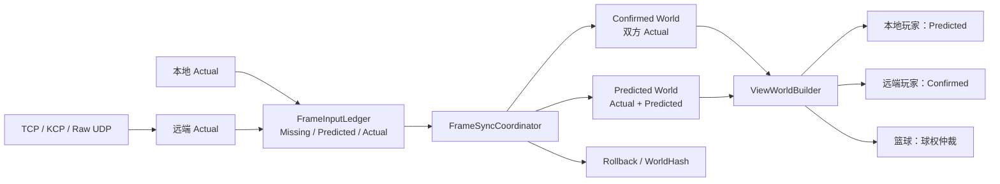
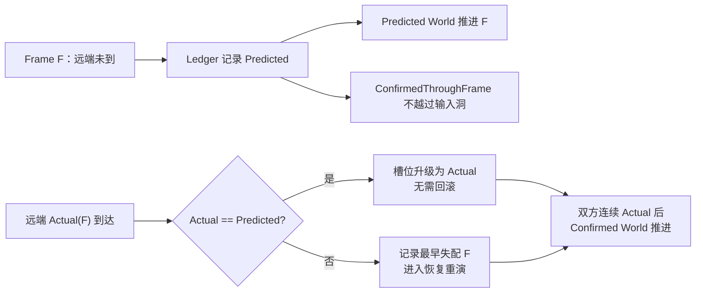
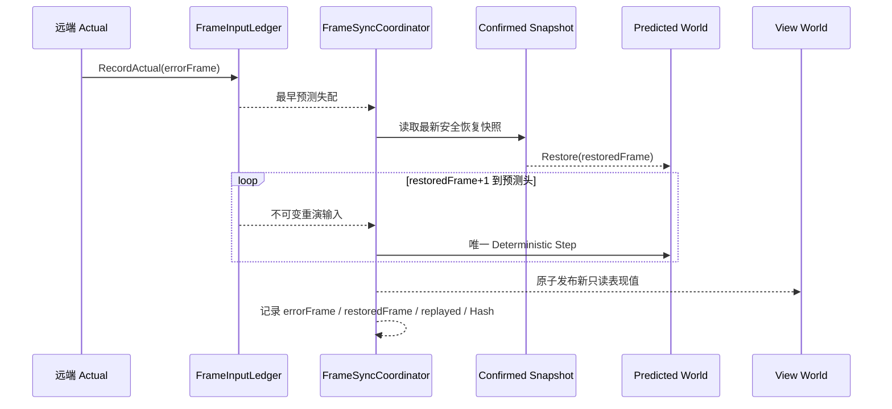

# Route C 帧同步作品集

> Unity 2022.3 / C# / 1v1 确定性篮球帧同步
>
> P2-F 已完成；P2-G 可选轻量 ECS 本轮主动延后；P2-H 文档准备进行中，最终状态仍需帅老大验收。

## 项目解决的问题

网络输入会迟到，但本地操作不能等待。如果直接在唯一世界中预测，真实输入到达后的纠错会同时污染稳定结果和画面；如果完全等待双方输入，本地响应又会变慢。

Route C 的解法是先把输入事实集中到 `FrameInputLedger`，再分离 Confirmed、Predicted 和 View 三种职责：Confirmed 只推进双方完整 Actual，Predicted 允许临时预测，View 只组合表现来源。预测失配后从确认快照恢复，并通过正常推进使用的同一个确定性 Step 重演。



## 关键设计决策

| 决策 | 解决的问题 | 不代表什么 |
|---|---|---|
| canonical frame | 统一网络帧、逻辑帧、日志和 Hash 的比较语义 | 两端临时 Predicted 状态必须相同 |
| InputLedger | 集中输入来源、确认头、最早失配和历史边界 | 缓冲容量等于确认进度或播放延迟 |
| Confirmed / Predicted 双世界 | 同时保留稳定事实和本地即时响应 | Confirmed 是服务器权威篮球世界 |
| 完整快照 + 唯一 Step 重演 | 恢复位置及所有会影响未来的隐藏状态 | 只修正 Transform 就能保证确定性 |
| 只读 View World | 为本地、远端和篮球选择不同表现来源 | 逻辑回滚正确后画面自动平滑 |
| 可插拔传输 | 用相同业务输入区分 TCP/KCP/Raw UDP 故障语义 | KCP 必然比 TCP 快固定比例 |
| 有界局内续连 | 在身份、进度和历史均安全时补齐短缺口 | 客户端/服务端重启续局或商业级断网重连 |

## 输入与确认时间线



这条时间线同时区分三件事：Ledger 能保存多少历史、Confirmed 已连续推进到哪一帧、View 当前播放哪一个表现区间。它们不能用同一个“缓冲帧数”概括。

## 预测失配恢复时序



## 三个代表案例

### 案例 1：预测命中

远端 Actual 与已使用的 Predicted 相同。Ledger 将该槽位升级为 Actual，Confirmed 继续推进，无需回滚。它证明预测并不必然触发重演，也不会因为输入迟到就重置世界。

代码与测试入口：[`FrameInputLedger`](../../Project/Frame%20Synchronization/Assets/Scripts/FrameSync/FrameInputLedger.cs)、[`FrameInputLedgerTests`](../../Project/Frame%20Synchronization/Assets/Tests/EditMode/FrameInputLedgerTests.cs)。

### 案例 2：预测失配与完整重演

远端 Actual 与 Predicted 不同。协调器定位最早失配帧，从最新 Confirmed 快照恢复，再以双方 Actual/Predicted 输入通过唯一 Step 重演未确认后缀。日志输出 `errorFrame`、`restoredFrame`、`replayed` 和最终 Hash；最终 Hash 收敛只证明确认状态一致，不否认中间发生过预测分叉。

代码与测试入口：[`FrameSyncCoordinator`](../../Project/Frame%20Synchronization/Assets/Scripts/FrameSync/FrameSyncCoordinator.cs)、[`FrameSyncCoordinatorTests`](../../Project/Frame%20Synchronization/Assets/Tests/EditMode/FrameSyncCoordinatorTests.cs)、[`GameController` 回滚日志](../../Project/Frame%20Synchronization/Assets/Scripts/GameController.cs)。

### 案例 3：KCP endpoint 受控续连与安全拒绝

同一客户端进程、同一服务端进程且服务器状态仍在时，约 3 秒无有效流量进入 Reconnecting；从最后有效通信起约 5 秒总宽限内，服务端校验 Session、Generation、Token、进度证明和不可变历史。成功样本更换 endpoint、Generation `1→2`、回放 8 帧并让双方回到 Running；宽限过期返回 `ResumeGraceExpired`，历史不足返回 `UnsafeResume`。

证据：[`成功续连`](../../p2f-kcp-live-reconnect-summary.json)、[`宽限过期`](../../p2f-kcp-live-grace-expired-summary.json)、[`历史不足`](../../p2f-kcp-live-history-expired-summary.json)。

## 证据导航

| 证据层 | 正式结果 | 证据入口 | 能证明什么 |
|---|---|---|---|
| Unity 自动化 | focused `257/257`；full `682/682` | [`focused`](../../TestResults-p2f-focused.xml)、[`full`](../../TestResults-p2f-full.xml) | 状态机、边界和回归用例通过 |
| KCP 协议 | `11/11` PASS | [`p2f-kcp-protocol.log`](../../p2f-kcp-protocol.log) | 协议、生命周期、会话和续连门禁 |
| 真实 Socket clean | p50/p95/p99 `16.1202/17.2516/31.9569ms` | [`clean summary`](../../p2f-kcp-live-clean-summary.json) | 当前机器 loopback 的真实端口/worker 基线 |
| 真实 Socket drop matrix | `12/12`；21,600 条；0 missing/duplicate | [`interval summary`](../../p2f-kcp-interval-summary.json) | 2% 上行 UDP datagram drop 下的数据完整性 |
| interval 10ms | p50/p95/p99 `15.9993/30.8883/53.3266ms`；CPU `2.680308%` 单核 | [`interval summary`](../../p2f-kcp-interval-summary.json) | 当前机器条件下的工程裁定，不是普遍定律 |
| 受控续连 | endpoint changed；Generation `1→2`；8 帧回放；双方 Running | [`reconnect summary`](../../p2f-kcp-live-reconnect-summary.json) | 协议级同进程局内续连成功路径 |
| 交付构建 | Windows x64 Success；net48 Release 142848 字节 | [`Player`](../../p2f-build-summary.json)、[`Server`](../../p2f-server-build-summary.json) | 可运行客户端和可核查服务端交付 |
| P2-F Task 12 独立只读审查 | 0 Critical；0 Important；2 Minor | [`review`](../../p2f-task12-independent-review.txt) | 只覆盖 Task 12 脚本、当时四份交付文档、fresh 证据与 Release/版本化服务端，不等于当前 P2-H 八文档审查 |
| Task 12 正式汇总审计 | `PASS_AUTOMATION_PENDING_MANUAL_ACCEPTANCE`（生成时状态） | [`final audit`](../../p2f-task12-final-audit.json) | 汇总自动化、构建、审查与当时人工验收边界；帅老大在生成后另行宣布 P2-F 验收完成 |
| TCP 对照 | 1800/1800；0 missing/duplicate；p50/p95/p99 `15.5274/62.3081/110.0901ms` | [`TCP control`](../../p2f-tcp-control-summary.json) | `tcp-recovered-loss-hol/application` 对照，不与 KCP UDP datagram drop 直接混比 |
| 人工画面 | P2-E、P2-F 已由帅老大宣布验收完成 | [路线规划](../../Project/路线规划_街篮帧同步最小实现.md) | 正常局画面、平滑度、手感和人球关系 |

自动化、真实 Socket 与人工画面是三层互补证据。自动化 PASS 不等于画面一定平滑；live probe 不等于 Unity endpoint 迁移画面已经演示；最终 Hash 收敛不等于中间从未预测分叉。

## 如何演示

完整启动顺序见[Windows 构建与双端演示](../demo/windows-build-and-demo.md)，约 5 分钟成片见[视频脚本](p2h-demo-video-script.md)。以下命令均在仓库根目录执行。

### KCP 正常局（0ms 人工注入延迟）

PowerShell A（服务端，保持前台运行）：

```powershell
& '.\Project\NetworkServer\NetworkServer.exe' --transport kcp --kcp-interval-ms 10
```

Editor 端在进入 Play 前临时选择 `KcpUdp`，进入 Play 后再打开 PowerShell B（Windows 客户端）：

```powershell
& '.\Project\Frame Synchronization\Builds\P2FTask12\RouteC.exe' --transport kcp --server-ip 127.0.0.1 --server-port 8888
```

`--kcp-interval-ms 10` 是 KCP 更新间隔，不是注入 10ms 网络延迟。录制结束后退出客户端、停止 Editor Play Mode，再在 PowerShell A 用 `Ctrl+C` 结束自己启动的前台服务端。

### TCP 固定 100ms 回滚表现

PowerShell A（服务端，保持前台运行）：

```powershell
& '.\Project\NetworkServer\NetworkServer.exe' --transport tcp --delay-ms 100
```

Editor 端在进入 Play 前临时选择 `Tcp` 并开启诊断，进入 Play 后再打开 PowerShell B（Windows 客户端）：

```powershell
& '.\Project\Frame Synchronization\Builds\P2FTask12\RouteC.exe' --transport tcp --server-ip 127.0.0.1 --server-port 8888 -p2eDiagnostics
```

录制 `[RouteC][Rollback]`、`errorFrame`、`restoredFrame`、`replayed` 和 Hash。录制结束后退出客户端、停止 Editor Play Mode，再在 PowerShell A 用 `Ctrl+C` 结束自己启动的前台服务端。

### 协议级续连边界

```powershell
& '.\Project\NetworkServer\KcpLiveSocketProbe.ps1' -ServerPath '.\Project\NetworkServer\NetworkServer.exe' -Scenario reconnect -IntervalMs 10
& '.\Project\NetworkServer\KcpLiveSocketProbe.ps1' -ServerPath '.\Project\NetworkServer\NetworkServer.exe' -Scenario grace-expired -IntervalMs 10
& '.\Project\NetworkServer\KcpLiveSocketProbe.ps1' -ServerPath '.\Project\NetworkServer\NetworkServer.exe' -Scenario history-expired -IntervalMs 10
```

## 简历与面试

- [中文/英文简历、30 秒与 2 分钟介绍](../career/街篮2式帧同步框架_最终目标与简历材料.md)
- [高频面试追问与准确回答](../interview/frame-sync-project-talk.md)
- [当前实现架构](../architecture/route-c-frame-sync.md)
- [StreetBall2 式最小架构与术语](../architecture/streetball2-minimal-frame-sync-v2.md)
- [KCP interval 裁定](../verification/2026-08-17-p2f-kcp-interval-decision.md)

## 主动保留的限制

- 服务器不运行权威篮球模拟，只转发输入。
- KCP 不应用 NetworkLab `--delay-ms`；没有 KCP 100ms Unity 人工结果。
- 生产 `KcpUdpClientTransport` 不会在 Socket 失效后自动重建 UDP Socket。
- 续连只覆盖同客户端进程、同服务端进程、服务器状态仍在、约 5 秒总宽限内的局内恢复。
- 没有客户端关闭/重启恢复、服务端重启恢复、任意 Wi-Fi/网线切换保证或商业级移动网络恢复。
- Unity 画面中的 endpoint 迁移未人工演示；相关结论来自真实 Socket probe。
- P2-G ECS/DOTS/Jobs/Burst 本轮主动延后，不写成当前能力。
- 比赛玩法保持 1v1 最小集合，没有为了作品集扩大技能、AI、匹配或后端范围。
