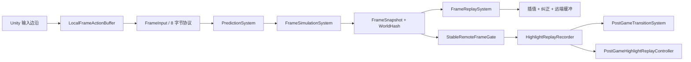

# P1-F Delivery Freeze Implementation Plan

> **For agentic workers:** REQUIRED SUB-SKILL: Use superpowers:subagent-driven-development (recommended) or superpowers:executing-plans to implement this plan task-by-task. Steps use checkbox (`- [ ]`) syntax for tracking.

**Goal:** Freeze the cumulative Route C implementation as a reproducible Unity project, close the shared postgame-terminal-frame and missing-regression gaps, and produce the minimum Windows/demo/interview delivery package.

**Architecture:** Keep live simulation, corrected snapshots, presentation buffering, and postgame playback separated. A stable recorder publishes one deterministic terminal frame; a small transition module restores that corrected world before `GameController` pauses the engine. Version Unity asset identities and the build scene, then document and verify the complete source-to-build workflow.

**Tech Stack:** Unity 2022.3.62f2, C# 9 runtime, NUnit EditMode tests, PowerShell, .NET Framework 4.8 server, Mermaid documentation.

**Repository constraints:** Work only in `E:\帧同步_RouteC`; keep `E:\帧同步` read-only. Do not reset, clean, overwrite with checkout, commit, merge, or push. The maintainer performs Git integration and every push manually. Do not start headless Unity while any Unity process is running.

**Approved design:** `docs/superpowers/specs/2026-08-10-p1f-delivery-freeze-design.md`

---

## File map

### Repository reproducibility

- Modify: `.gitignore`
- Add to versioned scope: `Project/Frame Synchronization/Assets/**/*.meta` when the target asset is tracked or included
- Add to versioned scope: `Project/Frame Synchronization/Assets/Scenes/SampleScene.unity`
- Add to versioned scope: `Project/Frame Synchronization/Assets/Scenes/SampleScene.unity.meta`
- Keep ignored: `Project/Frame Synchronization/Assets/Scenes/Tests/`

### Standards alignment

- Modify: `AGENTS.md`
- Modify: `Project/Frame Synchronization/AGENTS.md`
- Create: `Project/Frame Synchronization/Assets/Scripts/Presentation/HighlightPresentationSample.cs`
- Create: `Project/Frame Synchronization/Assets/Scripts/Presentation/HighlightPresentationSample.cs.meta`
- Modify: `Project/Frame Synchronization/Assets/Scripts/Presentation/HighlightSnapshotInterpolator.cs`

### Shared postgame terminal world

- Modify: `Project/Frame Synchronization/Assets/Scripts/Gameplay/HighlightReplayRecorder.cs`
- Modify: `Project/Frame Synchronization/Assets/Tests/EditMode/HighlightReplayRecorderTests.cs`
- Create: `Project/Frame Synchronization/Assets/Scripts/Gameplay/PostGameTransitionSystem.cs`
- Create: `Project/Frame Synchronization/Assets/Scripts/Gameplay/PostGameTransitionSystem.cs.meta`
- Create: `Project/Frame Synchronization/Assets/Tests/EditMode/PostGameTransitionSystemTests.cs`
- Create: `Project/Frame Synchronization/Assets/Tests/EditMode/PostGameTransitionSystemTests.cs.meta`
- Modify: `Project/Frame Synchronization/Assets/Scripts/GameController.cs`

### Local preparation/status UI

- Modify: `Project/Frame Synchronization/Assets/Scripts/Presentation/RuntimeControlOverlay.cs`
- Modify: `Project/Frame Synchronization/Assets/Tests/EditMode/RuntimeControlOverlayTests.cs`
- Modify: `Project/Frame Synchronization/Assets/Scripts/GameController.cs`

### Basketball rollback coverage

- Modify: `Project/Frame Synchronization/Assets/Tests/EditMode/FrameSimulationSystemTests.cs`

### Delivery material

- Create: `README.md`
- Create: `docs/architecture/route-c-frame-sync.md`
- Create: `docs/roadmap/p1f-delivery-status.md`
- Create: `docs/demo/windows-build-and-demo.md`
- Create: `docs/demo/demo-script-3-5min.md`
- Create: `docs/interview/frame-sync-project-talk.md`

---

### Task 1: Make Unity assets and the build scene reproducible

**Files:**
- Modify: `.gitignore`
- Include: required `.meta` files under `Project/Frame Synchronization/Assets/`
- Include: `Project/Frame Synchronization/Assets/Scenes/SampleScene.unity`
- Include: `Project/Frame Synchronization/Assets/Scenes/SampleScene.unity.meta`

- [ ] **Step 1: Run the pre-change asset guard and verify RED**

Run from `E:\帧同步_RouteC`:

```powershell
$repo = 'E:/帧同步_RouteC'
$scene = 'Project/Frame Synchronization/Assets/Scenes/SampleScene.unity'
$newAssets = @(git -C $repo -c core.quotePath=false ls-files --others --exclude-standard |
    Where-Object { $_ -match '^Project/Frame Synchronization/Assets/.+\.(cs|asmdef)$' })
$ignoredScene = @(git -C $repo check-ignore -- $scene).Count -gt 0
$ignoredMetas = @($newAssets | Where-Object {
    @(git -C $repo check-ignore -- "${_}.meta").Count -gt 0
}).Count
if (-not $ignoredScene -or $ignoredMetas -ne $newAssets.Count) {
    throw 'Expected the current scene and all new asset metas to be ignored.'
}
"RED confirmed: scene ignored; ignored new metas=$ignoredMetas"
```

Expected: `RED confirmed: scene ignored; ignored new metas=52`.

- [ ] **Step 2: Replace the broad ignore rules**

Change `.gitignore` so the relevant section is exactly:

```gitignore
# 排除 Unity 生成文件
Project/Frame Synchronization/Library/
Project/Frame Synchronization/obj/
Project/Frame Synchronization/Temp/
Project/Frame Synchronization/Logs/
Project/Frame Synchronization/UserSettings/
Project/Frame Synchronization/.idea/
Project/Frame Synchronization/*.csproj
Project/Frame Synchronization/*.sln
Project/Frame Synchronization/Builds/

# 只纳入正式构建场景，继续排除 Scenes 下的历史测试目录
Project/Frame Synchronization/Assets/Scenes/*
!Project/Frame Synchronization/Assets/Scenes/SampleScene.unity
!Project/Frame Synchronization/Assets/Scenes/SampleScene.unity.meta

# 排除临时文件
.claude/
.superpowers/
*.tmp
```

This removes the global `*.meta` rule and the blanket `Assets/Scenes/` directory rule.

- [ ] **Step 3: Verify every included asset has a meta and no ignored test-scene item leaked**

Run:

```powershell
$repo = 'E:/帧同步_RouteC'
$assetsRoot = Join-Path $repo 'Project/Frame Synchronization/Assets'
$tracked = @(git -C $repo -c core.quotePath=false ls-files -- 'Project/Frame Synchronization/Assets/**')
$untracked = @(git -C $repo -c core.quotePath=false ls-files --others --exclude-standard -- 'Project/Frame Synchronization/Assets/**')
$includedAssets = @($tracked + $untracked |
    Where-Object { $_ -notlike '*.meta' } |
    Where-Object { $_ -notlike 'Project/Frame Synchronization/Assets/Scenes/Tests/*' } |
    Sort-Object -Unique)
$missing = @($includedAssets | Where-Object {
    -not (Test-Path -LiteralPath (Join-Path $repo "${_}.meta"))
})
if ($missing.Count -gt 0) { throw "Missing meta:`n$($missing -join "`n")" }
$includedDirectories = @($includedAssets | ForEach-Object {
    $directory = Split-Path -Parent $_
    while ($directory -and
        $directory -ne 'Project\Frame Synchronization\Assets') {
        $directory
        $directory = Split-Path -Parent $directory
    }
} | Sort-Object -Unique)
$missingDirectoryMetas = @($includedDirectories | Where-Object {
    -not (Test-Path -LiteralPath (Join-Path $repo "${_}.meta"))
})
if ($missingDirectoryMetas.Count -gt 0) {
    throw "Missing directory meta:`n$($missingDirectoryMetas -join "`n")"
}
$leakedTests = @(git -C $repo -c core.quotePath=false status --short --untracked-files=all -- 'Project/Frame Synchronization/Assets/Scenes/Tests')
if ($leakedTests.Count -gt 0) { throw "Ignored scene tests leaked:`n$($leakedTests -join "`n")" }
if (@(git -C $repo check-ignore -- 'Project/Frame Synchronization/Assets/Scenes/SampleScene.unity').Count -gt 0) {
    throw 'SampleScene is still ignored.'
}
"GREEN: included assets=$($includedAssets.Count), missing file/directory metas=0, scene tests ignored"
```

Expected: `missing metas=0`, `SampleScene` is not ignored, and `Scenes/Tests` produces no status rows.

- [ ] **Step 4: Confirm build settings references the included scene**

Run:

```powershell
$settings = 'E:/帧同步_RouteC/Project/Frame Synchronization/ProjectSettings/EditorBuildSettings.asset'
$content = Get-Content -Raw -Encoding UTF8 -LiteralPath $settings
if (-not $content.Contains('path: Assets/Scenes/SampleScene.unity')) {
    throw 'SampleScene is missing from EditorBuildSettings.'
}
'GREEN: SampleScene is the configured build scene'
```

Expected: GREEN.

---

### Task 2: Align module rules and split the second public type

**Files:**
- Modify: `AGENTS.md`
- Modify: `Project/Frame Synchronization/AGENTS.md`
- Create: `Project/Frame Synchronization/Assets/Scripts/Presentation/HighlightPresentationSample.cs`
- Create: `Project/Frame Synchronization/Assets/Scripts/Presentation/HighlightPresentationSample.cs.meta`
- Modify: `Project/Frame Synchronization/Assets/Scripts/Presentation/HighlightSnapshotInterpolator.cs`

- [ ] **Step 1: Run the one-public-type guard and verify RED**

Run:

```powershell
$path = 'E:/帧同步_RouteC/Project/Frame Synchronization/Assets/Scripts/Presentation/HighlightSnapshotInterpolator.cs'
$count = @(Select-String -LiteralPath $path -Pattern '^\s*public\s+(?:static\s+)?(?:class|struct|enum|interface)\s+').Count
if ($count -ne 2) { throw "Expected two public types before split, got $count" }
'RED confirmed: HighlightSnapshotInterpolator.cs contains two public types'
```

Expected: RED confirmed.

- [ ] **Step 2: Move the sample into its own file**

Before creating the meta, verify the selected GUID is unused:

```powershell
if (rg -l --fixed-strings 'b8af29ce0f1a4b77a4cb508c9eb79c31' `
    'E:/帧同步_RouteC/Project/Frame Synchronization/Assets' | Select-Object -First 1) {
    throw 'HighlightPresentationSample GUID collision.'
}
```

Create `HighlightPresentationSample.cs`:

```csharp
using UnityEngine;

namespace FrameSyncDemo
{
    public struct HighlightPresentationSample
    {
        public Vector3 player0Position;
        public Vector3 player1Position;
        public Vector3 ballPosition;
    }
}
```

Create `HighlightPresentationSample.cs.meta`:

```yaml
fileFormatVersion: 2
guid: b8af29ce0f1a4b77a4cb508c9eb79c31
MonoImporter:
  externalObjects: {}
  serializedVersion: 2
  defaultReferences: []
  executionOrder: 0
  icon: {instanceID: 0}
  userData:
  assetBundleName:
  assetBundleVariant:
```

Delete only the `HighlightPresentationSample` struct declaration from `HighlightSnapshotInterpolator.cs`; keep its `using UnityEngine`, namespace, interpolator class, and behavior unchanged.

- [ ] **Step 3: Align both repository-guideline copies**

In both `AGENTS.md` files replace the existing runtime-location paragraph with:

```markdown
This repository contains a Unity 2022.3.62f2 project under `Project/Frame Synchronization/`. Runtime C# code is in `Assets/Scripts/` and uses the `FrameSyncDemo` namespace. Keep generic frame timelines, fixed-point math, snapshots, prediction, rollback coordination, and synchronized frame buffers in `Assets/Scripts/FrameSync/`; deterministic basketball domain simulation belongs in `Assets/Scripts/Gameplay/`; local render-update input edge capture belongs in `Assets/Scripts/Input/`; socket transport and connection settings belong in `Assets/Scripts/Network/`; presentation-only interpolation, correction, replay sampling, and runtime control overlays belong in `Assets/Scripts/Presentation/`; Unity editor extensions belong in `Assets/Scripts/Editor/`. Top-level orchestration and legacy debug controllers remain directly under `Assets/Scripts/`.
```

Do not change any safety, mode, approval, commit, or push rules.

- [ ] **Step 4: Verify GREEN and compile runtime**

Run:

```powershell
$project = 'E:/帧同步_RouteC/Project/Frame Synchronization'
$source = Join-Path $project 'Assets/Scripts/Presentation/HighlightSnapshotInterpolator.cs'
$sample = Join-Path $project 'Assets/Scripts/Presentation/HighlightPresentationSample.cs'
$counts = @($source, $sample | ForEach-Object {
    @(Select-String -LiteralPath $_ -Pattern '^\s*public\s+(?:static\s+)?(?:class|struct|enum|interface)\s+').Count
})
if ($counts[0] -ne 1 -or $counts[1] -ne 1) { throw "Public type counts: $($counts -join ',')" }
$rsp = Join-Path $project 'Library/Bee/artifacts/1900b0aE.dag/FrameSyncDemo.Runtime.rsp'
& 'C:/Program Files/dotnet/dotnet.exe' 'C:/Unity/unity2022/Editor/Data/DotNetSdkRoslyn/csc.dll' "@$rsp" $sample
if ($LASTEXITCODE -ne 0) { throw 'Runtime compilation failed.' }
'GREEN: one public type per file and runtime compilation passed'
```

Expected: compiler exit 0. If Unity has already added the new source to the response file, omit `$sample` to avoid a duplicate-source warning.

---

### Task 3: Publish one deterministic postgame terminal frame

**Files:**
- Modify: `Project/Frame Synchronization/Assets/Tests/EditMode/HighlightReplayRecorderTests.cs`
- Modify: `Project/Frame Synchronization/Assets/Scripts/Gameplay/HighlightReplayRecorder.cs`

- [ ] **Step 1: Add failing terminal-frame assertions**

Extend `ProcessStableFrame_EndMatchFromEitherPlayer_UsesFirstFrame` with:

```csharp
Assert.AreEqual(0, recorder.PostGameTerminalFrame);
```

Extend `ProcessStableFrame_EndRequestedDuringPostRoll_WaitsForClip` inside frame 110 with:

```csharp
Assert.AreEqual(-1, recorder.PostGameTerminalFrame);
```

and after the loop with:

```csharp
Assert.AreEqual(145, recorder.PostGameTerminalFrame);
```

Add this test:

```csharp
[Test]
public void ProcessStableFrame_SameStableHistory_PublishesSameTerminalFrame()
{
    var first = new HighlightReplayRecorder();
    var second = new HighlightReplayRecorder();

    for (int frame = 0; frame <= 145; frame++)
    {
        BallEntity.EState state = frame < 70
            ? BallEntity.EState.Held
            : frame < 100
                ? BallEntity.EState.Airborne
                : BallEntity.EState.Scored;
        FrameInput endInput = new FrameInput();
        if (frame == 110)
            endInput.endMatchPressed = true;
        FrameSnapshot snapshot = CreateSnapshot(frame, state);
        FrameInput[] inputs = { endInput, new FrameInput() };

        first.ProcessStableFrame(frame, snapshot, inputs);
        second.ProcessStableFrame(frame, snapshot, inputs);
    }

    Assert.AreEqual(145, first.PostGameTerminalFrame);
    Assert.AreEqual(first.PostGameTerminalFrame, second.PostGameTerminalFrame);
}
```

- [ ] **Step 2: Run the focused fixture and verify RED**

Use Appendix A to build the temporary runner, then run:

```powershell
& 'C:/Unity/unity2022/Editor/Data/MonoBleedingEdge/bin/mono.exe' `
  'C:/tmp/RouteC-P1F-Freeze-Runner/RouteCFocusedTestRunner.exe' `
  'E:/帧同步_RouteC/Project/Frame Synchronization/Library/Bee/artifacts/1900b0aE.dag/FrameSyncDemo.Tests.EditMode.dll' `
  'FrameSyncDemo.Tests.HighlightReplayRecorderTests'
```

Expected: compile failure because `PostGameTerminalFrame` does not exist.

- [ ] **Step 3: Implement terminal-frame publication**

Add to `HighlightReplayRecorder`:

```csharp
public int PostGameTerminalFrame { get; private set; } = -1;

public bool CanEnterPostGame => PostGameTerminalFrame >= 0;
```

Remove the old expression-bodied `CanEnterPostGame`. At the end of `ProcessStableFrame`, after `FinalizeReadyClips(frameID)`, call:

```csharp
PublishPostGameTerminalFrame(frameID);
```

Add:

```csharp
private void PublishPostGameTerminalFrame(int stableFrame)
{
    if (PostGameTerminalFrame >= 0 ||
        !EndMatchRequested ||
        _pendingClips.Count > 0)
    {
        return;
    }

    PostGameTerminalFrame = stableFrame;
}
```

In `RebaseAt`, reset an unpublished transition while preserving the first F9 request:

```csharp
PostGameTerminalFrame = -1;
```

- [ ] **Step 4: Compile and verify GREEN**

Compile Runtime and EditMode assemblies using Appendix B, rebuild the temporary runner, and rerun `HighlightReplayRecorderTests`.

Expected: all recorder tests pass; no terminal frame appears before the last pending clip finishes.

---

### Task 4: Restore the corrected terminal world before pausing

**Files:**
- Create: `Project/Frame Synchronization/Assets/Scripts/Gameplay/PostGameTransitionSystem.cs`
- Create: `Project/Frame Synchronization/Assets/Scripts/Gameplay/PostGameTransitionSystem.cs.meta`
- Create: `Project/Frame Synchronization/Assets/Tests/EditMode/PostGameTransitionSystemTests.cs`
- Create: `Project/Frame Synchronization/Assets/Tests/EditMode/PostGameTransitionSystemTests.cs.meta`
- Modify: `Project/Frame Synchronization/Assets/Scripts/GameController.cs`

- [ ] **Step 1: Write failing transition tests**

Create `PostGameTransitionSystemTests.cs`:

```csharp
using NUnit.Framework;

namespace FrameSyncDemo.Tests
{
    public class PostGameTransitionSystemTests
    {
        [Test]
        public void TryRestoreTerminalWorld_DifferentCurrentHeads_RestoresSameWorld()
        {
            World first = CreateWorld(-2, 2);
            World second = CreateWorld(-2, 2);
            var firstPrediction = new PredictionSystem();
            var secondPrediction = new PredictionSystem();
            firstPrediction.Init();
            secondPrediction.Init();
            firstPrediction.TakeWorldSnapshot(0, first.players, first.ball);
            secondPrediction.TakeWorldSnapshot(0, second.players, second.ball);

            first.players[0].position.x = FixedInt.FromInt(20);
            second.players[0].position.x = FixedInt.FromInt(40);
            HighlightReplayRecorder firstRecorder = CreateEndedRecorder();
            HighlightReplayRecorder secondRecorder = CreateEndedRecorder();

            Assert.IsTrue(PostGameTransitionSystem.TryRestoreTerminalWorld(
                firstRecorder, firstPrediction, first.players, first.ball, out int firstFrame));
            Assert.IsTrue(PostGameTransitionSystem.TryRestoreTerminalWorld(
                secondRecorder, secondPrediction, second.players, second.ball, out int secondFrame));

            Assert.AreEqual(0, firstFrame);
            Assert.AreEqual(firstFrame, secondFrame);
            FrameSnapshot firstSnapshot = firstPrediction.TakeWorldSnapshot(
                1, first.players, first.ball);
            FrameSnapshot secondSnapshot = secondPrediction.TakeWorldSnapshot(
                1, second.players, second.ball);
            Assert.AreEqual(
                WorldHash.Compute(firstSnapshot, firstFrame),
                WorldHash.Compute(secondSnapshot, secondFrame));
        }

        [Test]
        public void TryRestoreTerminalWorld_MissingSnapshot_DoesNotMutateWorld()
        {
            World world = CreateWorld(-2, 2);
            var prediction = new PredictionSystem();
            prediction.Init();
            HighlightReplayRecorder recorder = CreateEndedRecorder();
            FixedVector3 before = world.players[0].position;

            bool restored = PostGameTransitionSystem.TryRestoreTerminalWorld(
                recorder, prediction, world.players, world.ball, out int terminalFrame);

            Assert.IsFalse(restored);
            Assert.AreEqual(0, terminalFrame);
            Assert.AreEqual(before, world.players[0].position);
        }

        private static HighlightReplayRecorder CreateEndedRecorder()
        {
            var recorder = new HighlightReplayRecorder();
            FrameInput end = new FrameInput();
            end.endMatchPressed = true;
            recorder.ProcessStableFrame(
                0,
                new FrameSnapshot
                {
                    frameID = 0,
                    ballState = (int)BallEntity.EState.Free,
                    ballHolder = -1
                },
                new[] { end, new FrameInput() });
            return recorder;
        }

        private static World CreateWorld(int player0X, int player1X)
        {
            var player0 = new PlayerEntity();
            var player1 = new PlayerEntity();
            player0.Reset(new FixedVector3(FixedInt.FromInt(player0X), FixedInt.Zero, FixedInt.Zero), 0);
            player1.Reset(new FixedVector3(FixedInt.FromInt(player1X), FixedInt.Zero, FixedInt.Zero), 1);
            var ball = new BallEntity
            {
                position = FixedVector3.Zero,
                velocity = FixedVector3.Zero,
                state = BallEntity.EState.Free,
                holderPlayerIndex = -1
            };
            return new World(new[] { player0, player1 }, ball);
        }

        private sealed class World
        {
            public readonly PlayerEntity[] players;
            public readonly BallEntity ball;

            public World(PlayerEntity[] players, BallEntity ball)
            {
                this.players = players;
                this.ball = ball;
            }
        }
    }
}
```

Create its `.meta` with GUID `e4d14af6df4e4d65bb2f76be96f48c5d` and the same `MonoImporter` body used in Task 2.

- [ ] **Step 2: Run the fixture and verify RED**

Compile with Appendix B, including the new test source explicitly, then run `FrameSyncDemo.Tests.PostGameTransitionSystemTests` with Appendix A.

Expected: compile failure because `PostGameTransitionSystem` does not exist.

- [ ] **Step 3: Implement the transition module**

Create `PostGameTransitionSystem.cs`:

```csharp
namespace FrameSyncDemo
{
    public static class PostGameTransitionSystem
    {
        public static bool TryRestoreTerminalWorld(
            HighlightReplayRecorder recorder,
            PredictionSystem predictionSystem,
            PlayerEntity[] players,
            BallEntity ball,
            out int terminalFrame)
        {
            terminalFrame = recorder?.PostGameTerminalFrame ?? -1;
            if (terminalFrame < 0 || predictionSystem == null)
                return false;

            return predictionSystem.RestoreWorldSnapshot(
                terminalFrame,
                players,
                ball);
        }
    }
}
```

Create its `.meta` with GUID `a35d981c07884a7db283390505fcd3e4` and the Task 2 `MonoImporter` body.

- [ ] **Step 4: Verify module GREEN**

Compile Runtime and EditMode with both new sources explicitly and run `PostGameTransitionSystemTests`.

Expected: 2 passed, 0 failed.

- [ ] **Step 5: Integrate an all-or-nothing transition in GameController**

Replace `EnterPostGameReplay` with:

```csharp
private void EnterPostGameReplay()
{
    if (_matchPhase == MatchPhase.PostGameReplay)
        return;

    if (!PostGameTransitionSystem.TryRestoreTerminalWorld(
        _highlightRecorder,
        _predictionSystem,
        _playerEntities,
        _ballEntity,
        out int terminalFrame))
    {
        Debug.LogError(
            $"[RouteC][Highlight] terminal snapshot missing " +
            $"frame={terminalFrame}; postgame transition cancelled");
        return;
    }

    ClearLocalFrameActionsForCurrentRenderFrame();
    SnapPresentationToLogic(terminalFrame);
    _frameEngine.Pause();
    _matchPhase = MatchPhase.PostGameReplay;
    _highlightReplayController =
        new PostGameHighlightReplayController(_highlightRecorder.Clips);
    Debug.Log(
        $"[RouteC][Highlight] postgame replay started " +
        $"requestFrame={_highlightRecorder.EndMatchRequestFrame} " +
        $"terminalFrame={terminalFrame} " +
        $"clipCount={_highlightRecorder.Clips.Count}");
}
```

Change the existing presentation snap method into an overload pair:

```csharp
private void SnapPresentationToLogic()
{
    SnapPresentationToLogic(_frameEngine.CurrentFrame - 1);
}

private void SnapPresentationToLogic(int frameID)
{
    if (_playerCorrectionSmoothers != null)
    {
        for (int i = 0; i < _playerCorrectionSmoothers.Length; i++)
            _playerCorrectionSmoothers[i]?.Snap();
    }

    _ballSmoother?.Snap();
    _hasPresentedBallAttachment = false;
    _lastPresentedBallAttachmentIndex = -1;
    _presentationInterpolator?.Reset(
        frameID,
        _playerEntities,
        _ballEntity);
    SyncPresentationFromLogic(0f);
}
```

- [ ] **Step 6: Compile all three assemblies**

Use Appendix B. Expected: Runtime, Editor, and EditMode compiler exit codes are all 0.

---

### Task 5: Add local shot preparation and basketball status text

**Files:**
- Modify: `Project/Frame Synchronization/Assets/Tests/EditMode/RuntimeControlOverlayTests.cs`
- Modify: `Project/Frame Synchronization/Assets/Scripts/Presentation/RuntimeControlOverlay.cs`
- Modify: `Project/Frame Synchronization/Assets/Scripts/GameController.cs`

- [ ] **Step 1: Write failing pure text and policy tests**

Update every `BuildText` call to pass these three new arguments immediately after `waitingForHighlightTail`:

```csharp
false,
BallEntity.EState.Free,
-1,
```

Add:

```csharp
[Test]
public void BuildText_PlayingWithHeldBallAndPreparation_ShowsStatus()
{
    string text = RuntimeControlOverlay.BuildText(
        MatchPhase.Playing,
        false,
        true,
        BallEntity.EState.Held,
        1,
        0,
        0,
        null,
        false);

    StringAssert.Contains("篮球：Held", text);
    StringAssert.Contains("持球者：P2", text);
    StringAssert.Contains("准备投篮，松开出手", text);
}

[TestCase(MatchPhase.PostGameReplay, false, true, true, false)]
[TestCase(MatchPhase.Playing, true, true, true, false)]
[TestCase(MatchPhase.Playing, false, false, true, false)]
[TestCase(MatchPhase.Playing, false, true, false, false)]
[TestCase(MatchPhase.Playing, false, true, true, true)]
public void ShouldShowShotPreparation_UsesOnlyLocalPresentationState(
    MatchPhase phase,
    bool paused,
    bool spaceHeld,
    bool localHasBall,
    bool expected)
{
    Assert.AreEqual(
        expected,
        RuntimeControlOverlay.ShouldShowShotPreparation(
            phase,
            paused,
            spaceHeld,
            localHasBall));
}
```

- [ ] **Step 2: Run the overlay fixture and verify RED**

Expected: compile failure because the signature and policy method do not exist.

- [ ] **Step 3: Implement the pure presentation state**

Add properties to `RuntimeControlOverlay`:

```csharp
public bool IsPreparingShot { get; set; }
public BallEntity.EState BallState { get; set; }
public int HolderPlayerIndex { get; set; } = -1;
```

Change `BuildText` to:

```csharp
public static string BuildText(
    MatchPhase phase,
    bool waitingForHighlightTail,
    bool isPreparingShot,
    BallEntity.EState ballState,
    int holderPlayerIndex,
    int clipIndex,
    int clipCount,
    HighlightClip currentClip,
    bool replayPlaying)
```

After `操作说明（比赛中）`, append:

```csharp
text.AppendLine($"篮球：{ballState}");
text.AppendLine(holderPlayerIndex >= 0
    ? $"持球者：P{holderPlayerIndex + 1}"
    : "持球者：无（自由球）");
if (isPreparingShot)
    text.AppendLine("状态：准备投篮，松开出手");
```

Add:

```csharp
public static bool ShouldShowShotPreparation(
    MatchPhase phase,
    bool paused,
    bool spaceHeld,
    bool localHasBall)
{
    return phase == MatchPhase.Playing &&
        !paused &&
        spaceHeld &&
        localHasBall;
}
```

Pass the three new properties from `OnGUI` to `BuildText`.

- [ ] **Step 4: Connect GameController without adding synchronized state**

In `UpdateControlOverlay`, before clip properties, add:

```csharp
int localPlayerIndex = GetPresentationLocalPlayerIndex();
bool localHasBall = _playerEntities != null &&
    localPlayerIndex >= 0 &&
    localPlayerIndex < _playerEntities.Length &&
    _playerEntities[localPlayerIndex].hasBall;
_controlOverlay.IsPreparingShot =
    RuntimeControlOverlay.ShouldShowShotPreparation(
        _matchPhase,
        _paused,
        Input.GetKey(KeyCode.Space),
        localHasBall);
_controlOverlay.BallState = _ballEntity != null
    ? _ballEntity.state
    : BallEntity.EState.Resetting;
_controlOverlay.HolderPlayerIndex = _ballEntity != null
    ? _ballEntity.holderPlayerIndex
    : -1;
```

Do not add fields to `FrameInput`, `FrameSnapshot`, entities, or `WorldHash`.

- [ ] **Step 5: Verify GREEN**

Compile all assemblies and run `RuntimeControlOverlayTests`.

Expected: all overlay tests pass and existing live/replay control text remains unchanged except for the new status lines.

---

### Task 6: Add basketball prediction/rollback characterization coverage

**Files:**
- Modify: `Project/Frame Synchronization/Assets/Tests/EditMode/FrameSimulationSystemTests.cs`

- [ ] **Step 1: Add rejected-pickup replay coverage**

Add:

```csharp
[Test]
public void RestoreAndReplay_PredictedPickupRejected_RestoresFreeWorld()
{
    World authoritative = CreateFreeBallWorld(FixedInt.FromInt(-1), FixedInt.FromInt(1));
    World predicted = CreateFreeBallWorld(FixedInt.FromInt(-1), FixedInt.FromInt(1));
    var prediction = new PredictionSystem();
    prediction.Init();
    prediction.TakeWorldSnapshot(0, predicted.players, predicted.ball);

    Step(authoritative, CreateInputs());
    Step(predicted, CreateInputs(player0PicksUp: true));
    Assert.AreEqual(BallEntity.EState.Held, predicted.ball.state);

    Assert.IsTrue(prediction.RestoreWorldSnapshot(
        0, predicted.players, predicted.ball));
    Step(predicted, CreateInputs());

    AssertWorldState(authoritative, predicted);
    Assert.AreEqual(BallEntity.EState.Free, predicted.ball.state);
    Assert.IsFalse(predicted.players[0].hasBall);
    Assert.IsFalse(predicted.players[1].hasBall);
}
```

- [ ] **Step 2: Add conflicting-holder convergence coverage**

Add:

```csharp
[Test]
public void RestoreAndReplay_DifferentPredictedHolders_ConvergeToAuthoritativeHash()
{
    World first = CreateFreeBallWorld(FixedInt.FromInt(-1), FixedInt.FromInt(1));
    World second = CreateFreeBallWorld(FixedInt.FromInt(-1), FixedInt.FromInt(1));
    var firstPrediction = new PredictionSystem();
    var secondPrediction = new PredictionSystem();
    firstPrediction.Init();
    secondPrediction.Init();
    firstPrediction.TakeWorldSnapshot(0, first.players, first.ball);
    secondPrediction.TakeWorldSnapshot(0, second.players, second.ball);

    Step(first, CreateInputs(player0PicksUp: true));
    Step(second, CreateInputs(player1PicksUp: true));
    Assert.AreEqual(0, first.ball.holderPlayerIndex);
    Assert.AreEqual(1, second.ball.holderPlayerIndex);

    Assert.IsTrue(firstPrediction.RestoreWorldSnapshot(0, first.players, first.ball));
    Assert.IsTrue(secondPrediction.RestoreWorldSnapshot(0, second.players, second.ball));
    FrameInput[] authoritative = CreateInputs(
        player0PicksUp: true,
        player1PicksUp: true);
    Step(first, authoritative);
    Step(second, authoritative);
    FrameSnapshot firstSnapshot = firstPrediction.TakeWorldSnapshot(
        1, first.players, first.ball);
    FrameSnapshot secondSnapshot = secondPrediction.TakeWorldSnapshot(
        1, second.players, second.ball);

    AssertWorldState(first, second);
    Assert.AreEqual(0, first.ball.holderPlayerIndex);
    Assert.AreEqual(
        WorldHash.Compute(firstSnapshot, 1),
        WorldHash.Compute(secondSnapshot, 1));
}
```

- [ ] **Step 3: Run the fixture as characterization**

Run `FrameSyncDemo.Tests.FrameSimulationSystemTests`.

Expected: both new tests pass against the current deterministic implementation. If either fails, stop and use systematic debugging before changing production code; do not weaken the assertions.

- [ ] **Step 4: Re-run shot correction coverage**

Confirm `RestoreAndReplay_CorrectedShotInput_MatchesAuthoritativeWorld` still passes in the same fixture.

Expected: all pickup and shot correction cases pass.

---

### Task 7: Create the portfolio delivery documents

**Files:**
- Create: `README.md`
- Create: `docs/architecture/route-c-frame-sync.md`
- Create: `docs/roadmap/p1f-delivery-status.md`
- Create: `docs/demo/windows-build-and-demo.md`
- Create: `docs/demo/demo-script-3-5min.md`
- Create: `docs/interview/frame-sync-project-talk.md`

- [ ] **Step 1: Write README.md**

Use these exact top-level sections and content requirements:

```markdown
# Route C 帧同步篮球 Demo

## 项目简介
两名客户端通过 8 字节输入帧协议驱动确定性篮球世界；客户端执行输入预测、完整世界快照、回滚重演、WorldHash 对比、远端表现缓冲和赛后精彩片段回放。

## 核心能力
- 定点数和整数帧驱动的确定性模拟
- Free → Held → Airborne/Scored → Free 篮球闭环
- 零输入预测纠错和完整世界回滚
- Canonical Frame 与 FNV-1a 64 位 WorldHash
- 本地低延迟、远端固定一帧额外表现缓冲
- 稳定纠正快照生成的赛后精彩片段

## 环境
- Unity 2022.3.62f2
- Windows x86_64
- .NET Framework 4.8 转发服务器

## 快速开始
链接到 `docs/demo/windows-build-and-demo.md`，说明先启动服务器，再启动 Editor 和 Windows 客户端。

## 操作
列出 WASD、E、Space、F9、P、[、]、R、Esc。

## 架构
链接到 `docs/architecture/route-c-frame-sync.md`。

## 验证证据
记录最终程序集编译、非原生测试、Unity EditMode、服务端屏障、双端人工验收和新工作区导入结果。

## 项目边界
明确无比分、倒计时、AI、犯规、动态缓冲、录像持久化和专用回放摄像机。

## 演示与面试材料
链接到录屏脚本和面试讲解稿。
```

Replace the instructional sentences with the verified final values during Task 8; do not leave placeholders.

- [ ] **Step 2: Write the architecture document**

Include this Mermaid flow and a responsibility table:



The table must cover `FrameEngine`, `PredictionSystem`, `FrameSimulationSystem`, `FrameReplaySystem`, presentation components, stable-frame components, and the server.

- [ ] **Step 3: Write roadmap, build guide, demo script, and interview guide**

The roadmap must mark P0–P1-E complete, P1-F-0 complete, P1-F-1–F-6 completed through the expanded implementation, P1-F-7 manual gameplay accepted but delivery incomplete before this stage, and P1-F-8 as the current freeze.

The build guide must use:

```text
Scene: Assets/Scenes/SampleScene.unity
Platform: PC, Mac & Linux Standalone
Target Platform: Windows
Architecture: x86_64
Server: Project/NetworkServer/NetworkServer.exe
Endpoint: 127.0.0.1:8888
Client pairing: Unity Editor = player 0, Windows build = player 1
```

The 3–5 minute script must allocate time as follows:

```text
00:00–00:30  项目问题与架构
00:30–01:20  双端启动和最小篮球闭环
01:20–02:20  100ms 延迟下预测、回滚和 WorldHash
02:20–03:20  F9 共同结束与精彩回放
03:20–04:20  测试证据、模块取舍和明确边界
```

The interview guide must explain deterministic state boundaries, zero-input prediction, complete snapshot replay, canonical frames, logic/presentation separation, the stable-frame gate race fix, history-expiry recovery, and the shared terminal-frame fix.

- [ ] **Step 4: Validate links and placeholders**

Run:

```powershell
$docs = @(
  'README.md',
  'docs/architecture/route-c-frame-sync.md',
  'docs/roadmap/p1f-delivery-status.md',
  'docs/demo/windows-build-and-demo.md',
  'docs/demo/demo-script-3-5min.md',
  'docs/interview/frame-sync-project-talk.md'
)
foreach ($doc in $docs) {
    if (-not (Test-Path -LiteralPath $doc)) { throw "Missing $doc" }
    $bad = @(Select-String -LiteralPath $doc -Pattern 'TBD|TODO|待补充|PLACEHOLDER')
    if ($bad.Count -gt 0) { throw "Placeholder in $doc" }
}
'GREEN: delivery documents exist without placeholders'
```

Expected: GREEN.

---

### Task 8: Run automated verification and prepare Unity handoff

**Files:**
- Verify all files changed in Tasks 1–7.
- Do not create repository-local test results or Windows build artifacts.

- [ ] **Step 1: Recompile Runtime, Editor, and EditMode**

Use Appendix B. Expected: exit 0 for all three compilers.

- [ ] **Step 2: Run focused changed fixtures**

Build Appendix A runner and run:

```powershell
$runner = 'C:/tmp/RouteC-P1F-Freeze-Runner/RouteCFocusedTestRunner.exe'
$tests = 'E:/帧同步_RouteC/Project/Frame Synchronization/Library/Bee/artifacts/1900b0aE.dag/FrameSyncDemo.Tests.EditMode.dll'
$mono = 'C:/Unity/unity2022/Editor/Data/MonoBleedingEdge/bin/mono.exe'
& $mono $runner $tests `
  'FrameSyncDemo.Tests.HighlightReplayRecorderTests' `
  'FrameSyncDemo.Tests.PostGameTransitionSystemTests' `
  'FrameSyncDemo.Tests.RuntimeControlOverlayTests' `
  'FrameSyncDemo.Tests.FrameSimulationSystemTests' `
  'FrameSyncDemo.Tests.HighlightSnapshotInterpolatorTests'
if ($LASTEXITCODE -ne 0) { throw 'Focused regression failed.' }
```

Expected: zero failures.

- [ ] **Step 3: Run the complete non-native fixture list**

Pass every fixture returned by this command to the runner:

```powershell
$testRoot = 'E:/帧同步_RouteC/Project/Frame Synchronization/Assets/Tests/EditMode'
$fixtures = @(rg -n --no-heading '^\s*public\s+class\s+([A-Za-z0-9_]+Tests)' $testRoot |
    ForEach-Object {
        if ($_ -match 'public\s+class\s+([A-Za-z0-9_]+Tests)') {
            "FrameSyncDemo.Tests.$($Matches[1])"
        }
    } | Sort-Object -Unique)
& $mono $runner $tests $fixtures
if ($LASTEXITCODE -ne 0) { throw 'Full non-native regression failed.' }
```

Expected: zero failures. Unity-native cases may be reported as the previously known conditional skips only; record the exact final totals in README.

- [ ] **Step 4: Run server protocol verification**

Run:

```powershell
& 'E:/帧同步_RouteC/Project/NetworkServer/NetworkServerBarrierTests.ps1'
if ($LASTEXITCODE -ne 0) { throw 'Network server barrier verification failed.' }
```

Expected: barrier and bidirectional fragmented frame-0 forwarding pass.

- [ ] **Step 5: Run repository and asset guards**

Run:

```powershell
$env:GIT_OPTIONAL_LOCKS = '0'
git diff --check
if ($LASTEXITCODE -ne 0) { throw 'Whitespace check failed.' }
git diff --cached --check
if ($LASTEXITCODE -ne 0) { throw 'Cached whitespace check failed.' }
git -c core.quotePath=false status --short --untracked-files=all
git -C 'E:/帧同步' branch --show-current
git -C 'E:/帧同步' rev-parse HEAD
```

Expected: no whitespace errors; original repository remains `main` at `346b9ed235523ee3cd5fa9bb55d7f405a12cb1a7` with its original three-row fingerprint.

- [ ] **Step 6: Perform a source-only clone/export validation without changing Git history**

Create a temporary export outside the repository using the exact included-file set. Do not use `git clean`, reset, or checkout. Copy tracked files plus intended untracked delivery files to `C:/tmp/RouteC-P1F-Freeze-Import`, then verify:

```text
Assets/Scenes/SampleScene.unity exists
Every included Unity asset has its .meta
Assets/Scenes/Tests/Tests.asmdef does not exist
Library, Temp, Logs, obj and Builds do not exist
```

Import this directory only after all Unity processes are closed or when帅老大 explicitly performs the Unity import.

- [ ] **Step 7: Hand off Unity Test Runner and Windows build steps**

帅老大 performs:

1. Close other Unity projects or confirm Route C is the only project being tested.
2. Open Route C in Unity 2022.3.62f2 and confirm no Console compile errors.
3. Run all EditMode tests; record pass/fail/skip totals.
4. Confirm `SampleScene` is enabled in Build Settings.
5. Build Windows x86_64 to `C:\tmp\FrameSyncDemo-Windows`.
6. Start `Project\NetworkServer\NetworkServer.exe`, choose mode `0`, then run Editor + build.
7. Repeat the prediction/rollback demonstration with server mode `1` (100ms).
8. Verify pickup, shot, score/miss-to-Free loop, canonical-frame Hash convergence, F9 shared terminal frame, highlight ranges, P/[ / ]/R, and no rollback/network mutation during replay.

Expected: all items pass before completion is claimed.

---

### Task 9: Freeze the final status and prepare the maintainer commit manifest

**Files:**
- Create the next stage summary and handoff in `C:\tmp` only after all Task 8 verification is complete.
- Do not commit, merge, or push.

- [ ] **Step 1: Recompute both repository fingerprints**

Use the established algorithm: original `git status --short --untracked-files=all` order, LF joining, no trailing newline, UTF-8 without BOM, SHA-256. Record Route C count/fingerprint and confirm the original repository remains at three rows and `2992895D404E0E3DA707992A6096957379219F8DA0C6050D503F814F34B484D6`.

- [ ] **Step 2: Produce the maintainer commit groups without executing them**

Record the messages and exact scopes from Appendix C in the handoff:

```text
chore: track Unity asset identities and build scene
docs: add Route C design and implementation records
notes: explain prediction failure and render correction
feat: add deterministic basketball simulation and rollback core
fix: align canonical frames and harden network transport
feat: buffer and smooth remote presentation
feat: add synchronized postgame highlight replay
docs: add Route C build demo and interview guide
```

Resolve every Appendix C glob to concrete final status rows and record those rows under its message. Do not stage or commit automatically.

- [ ] **Step 3: Run completion verification before claiming done**

Invoke `verification-before-completion`, rerun the evidence commands, and ensure every claimed result comes from the final worktree rather than the P1-F-1 handoff baseline.

- [ ] **Step 4: Create the next-window handoff**

Invoke `handoff` and create:

```text
C:\tmp\帧同步_RouteC_P1-F-8_成果冻结与展示交付_阶段总结_2026-08-10.md
C:\tmp\帧同步_RouteC_P1-F-8完成_下一窗口交接提示词_2026-08-10.md
```

Stop after reporting completion and the manual commit/push boundary.

---

## Appendix A: Temporary reflection runner

Create `C:\tmp\RouteC-P1F-Freeze-Runner\RouteCFocusedTestRunner.cs` with:

```csharp
using System;
using System.Collections.Generic;
using System.Linq;
using System.Reflection;
using NUnit.Framework;

internal static class RouteCFocusedTestRunner
{
    private static int Main(string[] args)
    {
        if (args.Length < 2)
            return 2;

        Assembly assembly = Assembly.LoadFrom(args[0]);
        var requested = new HashSet<string>(
            args.Skip(1),
            StringComparer.Ordinal);
        int passed = 0;
        int failed = 0;
        int skipped = 0;

        foreach (Type fixtureType in assembly.GetTypes()
            .Where(type => requested.Contains(type.FullName)))
        {
            MethodInfo[] setups = fixtureType.GetMethods()
                .Where(method => method
                    .GetCustomAttributes(typeof(SetUpAttribute), true)
                    .Length > 0)
                .ToArray();
            MethodInfo[] teardowns = fixtureType.GetMethods()
                .Where(method => method
                    .GetCustomAttributes(typeof(TearDownAttribute), true)
                    .Length > 0)
                .ToArray();

            foreach (MethodInfo method in fixtureType.GetMethods())
            {
                if (method.GetCustomAttributes(
                    typeof(IgnoreAttribute),
                    true).Length > 0)
                {
                    continue;
                }

                TestCaseAttribute[] cases = method.GetCustomAttributes(
                        typeof(TestCaseAttribute),
                        true)
                    .Cast<TestCaseAttribute>()
                    .ToArray();
                bool isTest = method.GetCustomAttributes(
                    typeof(TestAttribute),
                    true).Length > 0;
                if (!isTest && cases.Length == 0)
                    continue;

                if (cases.Length == 0)
                {
                    RunCase(
                        fixtureType,
                        method,
                        Array.Empty<object>(),
                        setups,
                        teardowns,
                        ref passed,
                        ref failed,
                        ref skipped);
                }
                else
                {
                    foreach (TestCaseAttribute testCase in cases)
                    {
                        RunCase(
                            fixtureType,
                            method,
                            testCase.Arguments,
                            setups,
                            teardowns,
                            ref passed,
                            ref failed,
                            ref skipped);
                    }
                }
            }
        }

        Console.WriteLine(
            "Focused tests: " + passed + " passed, " +
            failed + " failed, " + skipped + " skipped");
        return failed == 0 ? 0 : 1;
    }

    private static void RunCase(
        Type fixtureType,
        MethodInfo method,
        object[] arguments,
        MethodInfo[] setups,
        MethodInfo[] teardowns,
        ref int passed,
        ref int failed,
        ref int skipped)
    {
        object fixture = Activator.CreateInstance(fixtureType);
        string name = fixtureType.FullName + "." + method.Name;
        try
        {
            foreach (MethodInfo setup in setups)
                setup.Invoke(fixture, Array.Empty<object>());

            method.Invoke(fixture, arguments);
            passed++;
            Console.WriteLine("PASS " + name);
        }
        catch (TargetInvocationException exception)
        {
            Exception cause = exception.InnerException ?? exception;
            string details = cause.ToString();
            if (details.Contains("get_unityLogger") ||
                details.Contains("can only be called from the main thread") ||
                details.Contains("internal call"))
            {
                skipped++;
                Console.WriteLine(
                    "SKIP " + name + ": Unity native runtime unavailable");
            }
            else
            {
                failed++;
                Console.Error.WriteLine(
                    "FAIL " + name + ": " + cause.Message);
            }
        }
        finally
        {
            foreach (MethodInfo teardown in teardowns)
                teardown.Invoke(fixture, Array.Empty<object>());
        }
    }
}
```

Build it with:

```powershell
$runnerRoot = 'C:/tmp/RouteC-P1F-Freeze-Runner'
$projectRoot = 'E:/帧同步_RouteC/Project/Frame Synchronization'
$nunit = Join-Path $projectRoot 'Library/PackageCache/com.unity.ext.nunit@1.0.6/net35/unity-custom/nunit.framework.dll'
New-Item -ItemType Directory -Path $runnerRoot -Force | Out-Null
& 'C:/Program Files/dotnet/dotnet.exe' `
  'C:/Unity/unity2022/Editor/Data/DotNetSdkRoslyn/csc.dll' `
  -nologo `
  -target:exe `
  -out:"$runnerRoot/RouteCFocusedTestRunner.exe" `
  -r:"$nunit" `
  "$runnerRoot/RouteCFocusedTestRunner.cs"
$artifactRoot = Join-Path $projectRoot 'Library/Bee/artifacts/1900b0aE.dag'
$env:MONO_PATH = [string]::Join(';', @(
  $artifactRoot,
  (Join-Path $projectRoot 'Library/PackageCache/com.unity.ext.nunit@1.0.6/net35/unity-custom'),
  'C:/Unity/unity2022/Editor/Data/Managed',
  'C:/Unity/unity2022/Editor/Data/Managed/UnityEngine'))
```

---

## Appendix B: Assembly compile commands

Run from PowerShell:

```powershell
$project = 'E:/帧同步_RouteC/Project/Frame Synchronization'
$artifact = Join-Path $project 'Library/Bee/artifacts/1900b0aE.dag'
$csc = 'C:/Unity/unity2022/Editor/Data/DotNetSdkRoslyn/csc.dll'
$dotnet = 'C:/Program Files/dotnet/dotnet.exe'
$newRuntime = @(
  (Join-Path $project 'Assets/Scripts/Presentation/HighlightPresentationSample.cs'),
  (Join-Path $project 'Assets/Scripts/Gameplay/PostGameTransitionSystem.cs'))
$newTests = @(
  (Join-Path $project 'Assets/Tests/EditMode/PostGameTransitionSystemTests.cs'))

& $dotnet $csc "@$(Join-Path $artifact 'FrameSyncDemo.Runtime.rsp')" $newRuntime
if ($LASTEXITCODE -ne 0) { throw 'Runtime compile failed.' }
& $dotnet $csc "@$(Join-Path $artifact 'FrameSyncDemo.Editor.rsp')"
if ($LASTEXITCODE -ne 0) { throw 'Editor compile failed.' }
& $dotnet $csc "@$(Join-Path $artifact 'FrameSyncDemo.Tests.EditMode.rsp')" $newTests
if ($LASTEXITCODE -ne 0) { throw 'EditMode compile failed.' }
```

If Unity has already regenerated a response file containing one of the explicit new source paths, remove only that duplicate explicit argument. Expected: all compiler exit codes are 0.

---

## Appendix C: Maintainer commit scopes

Resolve these scopes against the final status without staging them.

### `chore: track Unity asset identities and build scene`

```text
.gitignore
Project/Frame Synchronization/Assets/**/*.meta
Project/Frame Synchronization/Assets/Scenes/SampleScene.unity
Project/Frame Synchronization/Assets/Scenes/SampleScene.unity.meta
```

Exclude `Project/Frame Synchronization/Assets/Scenes/Tests/**`.

### `docs: add Route C design and implementation records`

```text
AGENTS.md
Project/Frame Synchronization/AGENTS.md
docs/superpowers/specs/*.md
docs/superpowers/plans/*.md
```

### `notes: explain prediction failure and render correction`

```text
Project/项目中疑问解答/Q004-正常帧同步如何处理预测失败与渲染纠正.md
```

### `feat: add deterministic basketball simulation and rollback core`

```text
Project/Frame Synchronization/Assets/Scripts/Editor/FrameSyncDemo.Editor.asmdef
Project/Frame Synchronization/Assets/Scripts/FrameSyncDemo.Runtime.asmdef
Project/Frame Synchronization/Assets/Scripts/FrameSync/FrameInput.cs
Project/Frame Synchronization/Assets/Scripts/FrameSync/FrameSnapshot.cs
Project/Frame Synchronization/Assets/Scripts/FrameSync/PredictionSystem.cs
Project/Frame Synchronization/Assets/Scripts/FrameSync/RollbackRequestBuffer.cs
Project/Frame Synchronization/Assets/Scripts/FrameSync/WorldHash.cs
Project/Frame Synchronization/Assets/Scripts/Gameplay/BallPhysicsSystem.cs
Project/Frame Synchronization/Assets/Scripts/Gameplay/BallPossessionSystem.cs
Project/Frame Synchronization/Assets/Scripts/Gameplay/BallShotSystem.cs
Project/Frame Synchronization/Assets/Scripts/Gameplay/CourtConstant.cs
Project/Frame Synchronization/Assets/Scripts/Gameplay/FrameReplayResult.cs
Project/Frame Synchronization/Assets/Scripts/Gameplay/FrameReplaySystem.cs
Project/Frame Synchronization/Assets/Scripts/Gameplay/FrameSimulationResult.cs
Project/Frame Synchronization/Assets/Scripts/Gameplay/FrameSimulationSystem.cs
Project/Frame Synchronization/Assets/Scripts/Gameplay/PlayerStateMachine.cs
Project/Frame Synchronization/Assets/Scripts/Input/LocalFrameActionBuffer.cs
Project/Frame Synchronization/Assets/Tests/EditMode/FrameSyncDemo.Tests.EditMode.asmdef
Project/Frame Synchronization/Assets/Tests/EditMode/BallPhysicsSystemTests.cs
Project/Frame Synchronization/Assets/Tests/EditMode/BallPossessionSystemTests.cs
Project/Frame Synchronization/Assets/Tests/EditMode/BallShotSystemTests.cs
Project/Frame Synchronization/Assets/Tests/EditMode/FrameInputTests.cs
Project/Frame Synchronization/Assets/Tests/EditMode/FrameReplaySystemTests.cs
Project/Frame Synchronization/Assets/Tests/EditMode/FrameSimulationSystemTests.cs
Project/Frame Synchronization/Assets/Tests/EditMode/LocalFrameActionBufferTests.cs
Project/Frame Synchronization/Assets/Tests/EditMode/PredictionSystemResolveRemoteTests.cs
Project/Frame Synchronization/Assets/Tests/EditMode/PredictionSystemSnapshotTests.cs
Project/Frame Synchronization/Assets/Tests/EditMode/RollbackRequestBufferTests.cs
Project/Frame Synchronization/Assets/Tests/EditMode/WorldHashTests.cs
```

### `fix: align canonical frames and harden network transport`

```text
Project/Frame Synchronization/Assets/Scripts/FrameSync/CanonicalFrame.cs
Project/Frame Synchronization/Assets/Scripts/FrameSync/NetworkFrameTimeline.cs
Project/Frame Synchronization/Assets/Scripts/Network/NetworkClient.cs
Project/Frame Synchronization/Assets/Scripts/Network/NetworkStreamReader.cs
Project/Frame Synchronization/Assets/Scripts/Network/NetworkTransportSettings.cs
Project/Frame Synchronization/Assets/Tests/EditMode/CanonicalFrameTests.cs
Project/Frame Synchronization/Assets/Tests/EditMode/NetworkFrameTimelineTests.cs
Project/Frame Synchronization/Assets/Tests/EditMode/NetworkStreamReaderTests.cs
Project/Frame Synchronization/Assets/Tests/EditMode/NetworkTransportSettingsTests.cs
Project/NetworkServer/NetworkServer.cs
Project/NetworkServer/NetworkServer.exe
Project/NetworkServer/NetworkServerBarrierTests.ps1
```

### `feat: buffer and smooth remote presentation`

```text
Project/Frame Synchronization/Assets/Scripts/FrameSync/FrameEngine.cs
Project/Frame Synchronization/Assets/Scripts/Presentation/PresentationBallSample.cs
Project/Frame Synchronization/Assets/Scripts/Presentation/PresentationCorrectionSmoother.cs
Project/Frame Synchronization/Assets/Scripts/Presentation/PresentationFrameInterpolator.cs
Project/Frame Synchronization/Assets/Scripts/Presentation/PresentationTargetResolver.cs
Project/Frame Synchronization/Assets/Tests/EditMode/PresentationCorrectionSmootherTests.cs
Project/Frame Synchronization/Assets/Tests/EditMode/PresentationFrameInterpolatorTests.cs
Project/Frame Synchronization/Assets/Tests/EditMode/PresentationTargetResolverTests.cs
```

### `feat: add synchronized postgame highlight replay`

```text
Project/Frame Synchronization/Assets/Scripts/Editor/FrameSyncWindow.cs
Project/Frame Synchronization/Assets/Scripts/FrameSync/FrameDebugger.cs
Project/Frame Synchronization/Assets/Scripts/GameController.cs
Project/Frame Synchronization/Assets/Scripts/Gameplay/HighlightClip.cs
Project/Frame Synchronization/Assets/Scripts/Gameplay/HighlightReplayRecorder.cs
Project/Frame Synchronization/Assets/Scripts/Gameplay/MatchPhase.cs
Project/Frame Synchronization/Assets/Scripts/Gameplay/PostGameTransitionSystem.cs
Project/Frame Synchronization/Assets/Scripts/Gameplay/StableFrameCursor.cs
Project/Frame Synchronization/Assets/Scripts/Gameplay/StableRemoteFrameGate.cs
Project/Frame Synchronization/Assets/Scripts/Presentation/HighlightPresentationSample.cs
Project/Frame Synchronization/Assets/Scripts/Presentation/HighlightSnapshotInterpolator.cs
Project/Frame Synchronization/Assets/Scripts/Presentation/PostGameHighlightReplayController.cs
Project/Frame Synchronization/Assets/Scripts/Presentation/RuntimeControlOverlay.cs
Project/Frame Synchronization/Assets/Tests/EditMode/HighlightReplayRecorderTests.cs
Project/Frame Synchronization/Assets/Tests/EditMode/HighlightSnapshotInterpolatorTests.cs
Project/Frame Synchronization/Assets/Tests/EditMode/PostGameHighlightReplayControllerTests.cs
Project/Frame Synchronization/Assets/Tests/EditMode/PostGameTransitionSystemTests.cs
Project/Frame Synchronization/Assets/Tests/EditMode/RuntimeControlOverlayTests.cs
Project/Frame Synchronization/Assets/Tests/EditMode/StableFrameCursorTests.cs
Project/Frame Synchronization/Assets/Tests/EditMode/StableRemoteFrameGateTests.cs
```

### `docs: add Route C build demo and interview guide`

```text
README.md
docs/architecture/route-c-frame-sync.md
docs/roadmap/p1f-delivery-status.md
docs/demo/windows-build-and-demo.md
docs/demo/demo-script-3-5min.md
docs/interview/frame-sync-project-talk.md
```
